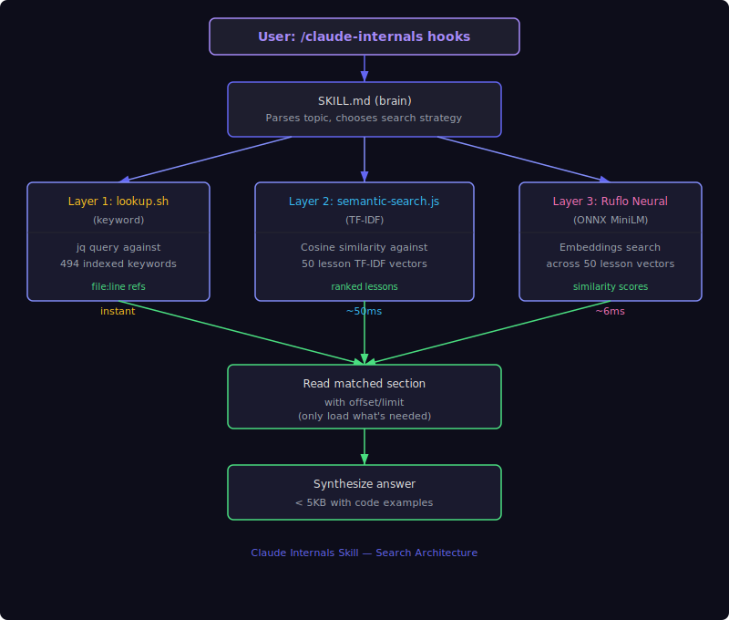

# Claude Code Internals

> A self-contained Claude Code skill that gives Claude source-level knowledge of its own architecture — 59 lessons covering every internal subsystem, verified against the v2.1.92 binary, searchable three ways.
>
> **This is a modified fork** of [stuinfla/claude-code-internals](https://github.com/stuinfla/claude-code-internals). See [Attribution](#attribution) for what changed.

[](https://yaniv-golan.github.io/claude-code-internals/static/install-claude-desktop.html)

[](https://opensource.org/licenses/MIT)
[](https://docs.anthropic.com/en/docs/agents-and-tools/claude-code/plugins)
[](https://github.com/yaniv-golan/skill-creator-plus)

**Skill Version:** 2.2.3 | **Captured from:** Claude Code v2.1.92 | **Date:** 2026-04-07 | **License:** MIT

---

## Installation

### Claude Desktop

[](https://yaniv-golan.github.io/claude-code-internals/static/install-claude-desktop.html)

*— or install manually —*

1. Click **Customize** in the sidebar
2. Click **Browse Plugins**
3. Go to the **Personal** tab and click **+**
4. Choose **Add marketplace**
5. Type `yaniv-golan/claude-code-internals` and click **Sync**

### Claude Code (CLI)

```bash
claude plugin marketplace add https://github.com/yaniv-golan/claude-code-internals
claude plugin install claude-code-internals@claude-code-internals-marketplace
```

Or from within a Claude Code session:

```
/plugin marketplace add yaniv-golan/claude-code-internals
/plugin install claude-code-internals@claude-code-internals-marketplace
```

### Claude.ai (Web)

1. Download [`claude-code-internals.zip`](https://github.com/yaniv-golan/claude-code-internals/releases/latest/download/claude-code-internals.zip)
2. Click **Customize** in the sidebar
3. Go to **Skills** and click **+**
4. Choose **Upload a skill** and upload the zip file

### Manus

1. Download [`claude-code-internals.zip`](https://github.com/yaniv-golan/claude-code-internals/releases/latest/download/claude-code-internals.zip)
2. Go to **Settings** → **Skills** → **+ Add** → **Upload**

### ChatGPT

1. Download [`claude-code-internals.zip`](https://github.com/yaniv-golan/claude-code-internals/releases/latest/download/claude-code-internals.zip)
2. Upload at [chatgpt.com/skills](https://chatgpt.com/skills)

> ChatGPT Skills are currently in beta, available on Business, Enterprise, Edu, and Healthcare plans.

### Codex CLI

```
$skill-installer https://github.com/yaniv-golan/claude-code-internals
```

Or manually: download the zip, extract the contents to `~/.codex/skills/claude-code-internals/`.

### From This Repo (manual)

```bash
cp -r skill-package/skills/claude-code-internals/* ~/.claude/skills/claude-code-internals/
chmod +x ~/.claude/skills/claude-code-internals/scripts/*.sh \
         ~/.claude/skills/claude-code-internals/scripts/*.js
```

### Activate the PreToolUse Hook (Optional)

Adds a gentle reminder whenever Claude edits `.claude/` config files. Add to `hooks` in `~/.claude/settings.json`:

```json
"PreToolUse": [
  {
    "matcher": "(Edit|Write|Bash)",
    "hooks": [
      {
        "type": "command",
        "command": "~/.claude/plugins/claude-code-internals/skills/claude-code-internals/scripts/config-aware-hook.sh",
        "timeout": 2000
      }
    ]
  }
]
```

---

## Table of Contents

- [What This Is](#what-this-is)
- [Why This Skill Is Useful](#why-this-skill-is-useful)
- [How It Works](#how-it-works)
- [Prerequisites](#prerequisites)
- [Usage Examples](#usage-examples)
- [Sample Output](#sample-output)
- [Getting the Most Out of It](#getting-the-most-out-of-it)
- [RuFlo & RuVector Integration](#ruflo--ruvector-integration--universal-knowledge-access)
- [Troubleshooting](#troubleshooting)
- [What's Inside](#whats-inside)
- [Version Tracking](#version-tracking)
- [Platform Compatibility](#platform-compatibility)
- [License](#license)

---

## What This Is

This is a Claude Code skill containing a complete reverse-engineering of Claude Code's internal architecture, verified against the v2.1.92 binary. 59 detailed lessons cover every major subsystem — from the boot sequence to undocumented features found directly in the binary. When you type `/claude-code-internals hooks` or `/claude-code-internals permissions`, Claude doesn't guess or hallucinate. It reads actual architecture documentation, searches through indexed reference material, and gives you source-level answers with code examples and type definitions.

Without this skill, Claude knows *how to use* Claude Code but doesn't know *how Claude Code works internally*. With it, Claude becomes an expert on its own implementation — the query engine's retry logic, all 27 hook event types, the 7-phase permission pipeline, the compaction algorithm, the agent spawn lifecycle, and binary-verified internals of features like `/effort`, `/rewind`, `/teleport`, `/branch`, and `/buddy`.

## Why This Skill Is Useful

### The Core Problem

Claude Code is a powerful tool, but Claude doesn't understand its own internals. Ask it "what hook events are available?" and it'll give you a partial, sometimes wrong answer. Ask it "why did compaction eat my context?" and it'll speculate. Ask it "how do permission modes actually work?" and you'll get a general answer that misses the 23 Bash security validators and the 7-phase decision pipeline.

### What Changes With This Skill

- **Claude stops guessing.** Every answer comes from indexed architecture documentation, not training data.
- **You get source-level depth.** Not "hooks let you run commands before and after tool use" but "PreToolUse hooks receive `{tool_name, tool_input}` as JSON on stdin, exit 0 proceeds silently, exit 1 proceeds with stderr shown to user, exit 2 blocks the tool and sends stderr to the model."
- **Configuration becomes precise.** Exact fields, valid values, and edge cases — no trial-and-error.
- **Debugging gets real answers.** "Why isn't my hook firing?" becomes answerable: hook config is snapshot-captured at startup, and the matcher regex must match the tool name exactly.

### Who Benefits Most

- **Claude Code power users** who configure hooks, agents, skills, and permissions
- **Developers building on Claude Code** who need to understand the agent system, coordinator mode, or MCP integration
- **Anyone debugging Claude Code behavior** who needs to understand what's happening under the hood

## How It Works

### Architecture



<details>
<summary>ASCII Version (for AI/accessibility)</summary>

```
                    User asks: "/claude-code-internals hooks"
                                    |
                                    v
                    +-------------------------------+
                    |        SKILL.md (brain)        |
                    |   Parses topic, chooses        |
                    |   search strategy              |
                    +-------------------------------+
                                    |
                   +----------------+----------------+
                   |                |                |
                   v                v                v
          +-------------+  +---------------+  +----------------+
          | lookup.sh   |  | semantic-     |  | fetch-lesson.js|
          | (keyword)   |  | search.js     |  | (by lesson ID) |
          |             |  | (TF-IDF)      |  |                |
          | jq query    |  | cosine sim    |  | xref.js        |
          | against 494 |  | against 59    |  | troubleshoot.js|
          | keywords    |  | lesson TF-IDF |  |                |
          +------+------+  +-------+-------+  +-------+--------+
                 |                 |                   |
                 +--------+--------+-------------------+
                          |
                          v
               +------------------------+
               |  fetch-lesson.js <id>   |
               |  returns content with   |
               |  no offset math needed  |
               +------------------------+
                          |
                          v
               +------------------------+
               |   Synthesize answer     |
               |   < 5KB with code       |
               |   examples              |
               +------------------------+
```

</details>

### The Search Layers

| Layer | Script | Best For |
|-------|--------|----------|
| **Unified (RRF)** | `search.js` | **Default** — combines keyword + TF-IDF via Reciprocal Rank Fusion |
| **Keyword** | `lookup.sh` | Exact terms: "hooks", "permissions", "KAIROS" |
| **TF-IDF** | `semantic-search.js` | Natural language: "how does Claude decide what tools to use" |

After search, `fetch-lesson.js <id>` retrieves the lesson content directly — no file path or line offset tracking required.

### Auto-Trigger Hook

A PreToolUse hook fires whenever Claude is about to edit files under `.claude/`. It injects a reminder into the model's context, nudging Claude to consult the architecture docs before modifying Claude Code configuration.

## Prerequisites

| Requirement | Minimum | Check | Notes |
|-------------|---------|-------|-------|
| **Claude Code** | v2.1.0+ | `claude --version` | Skills require a recent version |
| **Node.js** | v18+ | `node --version` | Required for TF-IDF search and fetch-lesson |
| **jq** | Any | `jq --version` | Required for keyword search |

```bash
# macOS (Homebrew)
brew install jq node
```

## Usage Examples

```
/claude-code-internals hooks
```
Returns all 27 hook event types, exit code semantics (0=proceed, 1=proceed+warn, 2=block), command types, configuration format, and the critical detail that hook config is snapshot-captured at startup.

```
/claude-code-internals permissions
```
Returns the 7-phase permission pipeline, 5 permission modes, the 23 Bash security validators, and rule matching logic.

```
/claude-code-internals why isn't my hook firing
```
Surfaces: startup snapshot-capture, matcher regex matching, exit code contract.

```
/claude-code-internals /effort
```
Returns the effort level API (low/medium/high/max/auto), the `effortLevel` settings key, `CLAUDE_CODE_EFFORT_LEVEL` env var, and the `ultrathink` implementation behind `max`.

```
/claude-code-internals /buddy
```
Returns the companion system internals: the date gate (April 2026+, first-party only), rarity tiers, companion state keys, and system prompt injection mechanism.

## Sample Output

**Unified RRF search** (`search.js "hook events"`):
```
[HIGH] Hooks System (L32)  04-connectivity-plugins.md L324–456
[HIGH] Hook event types (L10) cross-ref via permissions
[MED]  Settings/Config (L30)  startup snapshot behavior
```

**fetch-lesson** (`fetch-lesson.js 32`):
```
# Lesson 32: Hooks System
# Source: 04-connectivity-plugins.md L324–456

[full lesson content with type definitions, exit code table,
 all 27 event types, configuration examples...]
```

## Getting the Most Out of It

1. **Use it BEFORE configuring anything under `.claude/`.** The skill knows exact formats, valid values, and edge cases.
2. **Use natural language when keywords don't work.** "what happens when Claude runs out of context space" finds the compaction lesson even without the word "compaction."
3. **Know its limits.** Core lessons (1–50) were captured from Claude Code v2.1.88. Chapters 9–10 (lessons 51–59) were verified directly against the v2.1.90/v2.1.92 binary.

## Smart Features (v2.2)

### Unified Search (Reciprocal Rank Fusion)

`search.js` runs keyword + TF-IDF in parallel and merges results using RRF — results labeled **HIGH** (both layers agree), **MEDIUM** (one layer), or **LOW**.

### fetch-lesson.js — No Offset Math

```bash
node scripts/fetch-lesson.js 32          # Hooks System content
node scripts/fetch-lesson.js 32 --meta   # Metadata only (file, line range)
node scripts/fetch-lesson.js --list      # All 59 lessons
```

### xref.js — Shell-Safe Cross-Reference Lookup

```bash
node scripts/xref.js 10 29    # Related lessons for hooks + permissions
```

### troubleshoot.js — Shell-Safe Troubleshooting

```bash
node scripts/troubleshoot.js "hook not firing after restart"
# → Hint: Hook config snapshot-captured at startup → Lessons L32, L30, L1
```

### Maintenance Scripts (for contributors)

```bash
# Extract JS bundle from any Claude Code binary
bash scripts/extract-bundle.sh ~/.local/share/claude/versions/2.1.90/claude

# Structured diff between two bundle versions
bash scripts/diff-versions.sh claude-2.1.88-bundle.js claude-2.1.90-bundle.js
```

### Version Staleness Detection

```bash
bash scripts/check-version.sh
# Silent if versions match (currently v2.1.92)
# Warns if you are running a newer version
```

## RuFlo & RuVector Integration — Universal Knowledge Access

The skill works standalone. To make Claude Code architecture knowledge accessible to all agents, swarms, and task orchestration, load it into RuFlo and RuVector:

```bash
# Generate and store embeddings via Ruflo
cd ~/.claude/skills/claude-code-internals
node scripts/build-rvf-index.js
```

See the [full RuFlo integration guide](#) for cluster embeddings, lesson-level search, AgentDB references, and routing patterns.

## Troubleshooting

**"Unknown skill" when typing `/claude-code-internals`**
Skills register at startup. Restart Claude Code and try again.

**`lookup.sh` fails with "command not found: jq"**
Install jq: `brew install jq` (macOS) or `apt-get install jq` (Linux).

**`fetch-lesson.js` or `semantic-search.js` fails**
Check Node.js: `node --version` (requires v18+). Make scripts executable: `chmod +x scripts/*.js scripts/*.sh`.

**Hook doesn't fire when editing `.claude/` files**
Hook config is snapshot-captured at startup. Restart Claude Code after adding the hook.

## What's Inside

<details>
<summary>Directory Structure (click to expand)</summary>

```
claude-code-internals/
├── .claude-plugin/
│   └── marketplace.json            Marketplace plugin definition
├── skill-package/                  Plugin package
│   ├── .claude-plugin/
│   │   └── plugin.json             Plugin definition
│   ├── LICENSE
│   ├── README.md
│   └── skills/
│       └── claude-code-internals/  The skill itself
│           ├── SKILL.md            Skill brain (search strategy, lesson index)
│           ├── version.json        Version tracking (v2.2.3 / v2.1.92)
│           ├── hooks-config.json   PreToolUse hook definition
│           ├── references/
│           │   ├── 01-core-architecture-tools.md
│           │   ├── 02-agents-intelligence-interface.md
│           │   ├── 03-interface-infrastructure.md
│           │   ├── 04-connectivity-plugins.md
│           │   ├── 05-unreleased-bigpicture.md
│           │   ├── 06-verified-new-v2.1.90.md   ← Chapter 9 (binary-verified)
│           │   ├── 07-verified-new-v2.1.92.md   ← Chapter 10 (binary-verified)
│           │   ├── topic-index.json
│           │   ├── semantic-index.json
│           │   ├── cross-references.json
│           │   └── troubleshooting.json
│           └── scripts/
│               ├── fetch-lesson.js         Fetch lesson content by ID (new)
│               ├── xref.js                 Cross-reference lookup CLI (new)
│               ├── troubleshoot.js         Troubleshooting index CLI (new)
│               ├── extract-bundle.sh       Extract JS bundle from Bun SEA (new)
│               ├── diff-versions.sh        Diff env vars/commands between bundles (new)
│               ├── search.js               Unified RRF search (keyword + TF-IDF)
│               ├── semantic-search.js      TF-IDF search
│               ├── lookup.sh               Keyword search
│               ├── check-version.sh        Version staleness detection
│               ├── build-rvf-index.js      TF-IDF index builder
│               └── config-aware-hook.sh    PreToolUse .claude/ detector
├── site/
│   └── static/
│       └── install-claude-desktop.html  "Add to Claude" button page
├── .github/workflows/
│   ├── release.yml                 Auto-zip on tag push
│   └── deploy-site.yml             GitHub Pages deploy
├── claude-code-internals.zip       Latest release zip
└── README.md
```

</details>

<details>
<summary>The 59 Lessons — 10 Chapters (click to expand)</summary>

| Ch | File | Lessons |
|----|------|---------|
| 1–2 | `01-core-architecture-tools.md` | Boot Sequence, Query Engine, State Management, System Prompt, Architecture Overview, Tool System, Bash Tool, File Tools, Search Tools, MCP System |
| 3–4 | `02-agents-intelligence-interface.md` | Skills System, Agent System, Coordinator Mode, Teams/Swarm, Memory System, Auto-Memory, Ink Renderer, Commands System, Dialog/UI, Notifications |
| 4–5 | `03-interface-infrastructure.md` | Vim Mode, Keybindings, Fullscreen, Theme/Styling, Permissions, Settings/Config, Session Management, Context Compaction, Analytics/Telemetry, Migrations |
| 5–6 | `04-connectivity-plugins.md` | Plugin System, Hooks System, Error Handling, Bridge/Remote, OAuth, Git Integration, Upstream Proxy, Cron/Scheduling, Voice System, BUDDY Companion |
| 7–8 | `05-unreleased-bigpicture.md` | ULTRAPLAN (**now released** as research preview), Entrypoints/SDK, KAIROS Always-On, Cost Analytics, Desktop App, Model System, Sandbox/Security, Message Processing, Task System, REPL Screen |
| **9** | **`06-verified-new-v2.1.90.md`** | **/effort** (reasoning budget), **/rewind** (file checkpointing), **/teleport** (session transfer), **/branch** (conversation fork), Session resume & new env vars, New commands: /autocompact /buddy /powerup /toggle-memory |
| **10** | **`07-verified-new-v2.1.92.md`** | v2.1.92 command changes: **/setup-bedrock**, **/stop-hook** (disabled), /tag+/vim removed (L57). New env vars: **CLAUDE_CODE_EXECPATH**, CLAUDE_REMOTE_CONTROL_SESSION_NAME_PREFIX, CLAUDE_CODE_SKIP_FAST_MODE_ORG_CHECK (L58). **AskUserQuestionTool** full documentation (L59) |

</details>

## Version Tracking

```json
{
  "skill_version": "2.2.3",
  "captured_version": "2.1.92",
  "verified_against_binary": "2.1.92",
  "captured_date": "2026-04-07"
}
```

To update when Claude Code releases a new version:

```bash
# 1. Extract the new binary's bundle
bash scripts/extract-bundle.sh

# 2. Diff against the previous bundle
bash scripts/diff-versions.sh claude-2.1.90-bundle.js claude-<new>-bundle.js

# 3. Update references/ and add a new chapter lesson
# 4. Update version.json
# 5. Rebuild the TF-IDF index
node scripts/build-rvf-index.js
```

## Platform Compatibility

| Platform | Status | Notes |
|----------|--------|-------|
| **macOS** | Fully tested | Primary development platform |
| **Linux** | Expected to work | Uses standard bash, jq, Node.js |
| **Windows (WSL)** | Expected to work | Run inside WSL |
| **Windows (native)** | Not supported | Bash scripts require a Unix shell |

## Attribution

This repository is a fork of [stuinfla/claude-code-internals](https://github.com/stuinfla/claude-code-internals) (v2.0.0). All foundational work is by **stuinfla**, including:

- The 50 original lessons (Chapters 1–8), reverse-engineered from Claude Code v2.1.88
- The unified RRF search engine (`search.js`, `semantic-search.js`, `lookup.sh`)
- The 494-keyword topic index, TF-IDF vectors, cross-reference map, and troubleshooting index
- The PreToolUse `.claude/` hook (`config-aware-hook.sh`), version check script, and RuFlo index builder
- The original README documentation and architecture diagrams

**What this fork adds** (v2.2.0–v2.2.3, by Yaniv Golan, improved using [Skill Creator Plus](https://github.com/yaniv-golan/skill-creator-plus)):

- Chapter 9 (Lessons 51–56): binary-verified new features in Claude Code v2.1.90, extracted directly from the Bun SEA binary and verified against official docs
- Chapter 10 (Lessons 57–59): binary-verified changes in Claude Code v2.1.92 — new commands, removed commands, new env vars, and AskUserQuestionTool documentation
- ULTRAPLAN (L41) status updated: now officially released as research preview
- 5 new scripts: `fetch-lesson.js`, `xref.js`, `troubleshoot.js`, `extract-bundle.sh`, `diff-versions.sh`
- Plugin marketplace infrastructure: `.claude-plugin/` files, "Add to Claude" install button, GitHub Actions release and Pages deploy workflows
- Updated `SKILL.md` to use the new script CLIs instead of fragile inline `node -e` blocks

See [CHANGELOG.md](CHANGELOG.md) for the full item-by-item breakdown.

The architecture lesson content in `references/01–05` is sourced from [markdown.engineering](https://www.markdown.engineering/learn-claude-code/) and used for educational and tooling purposes.

## License

MIT License. See [LICENSE](LICENSE) for full text.
