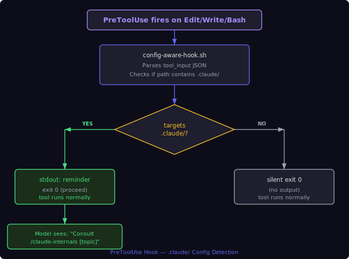
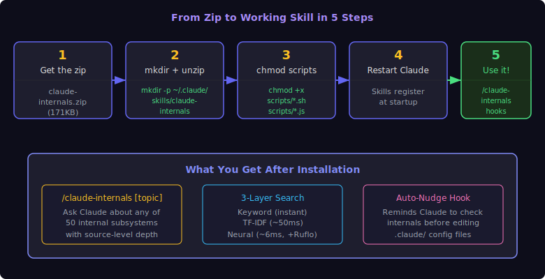
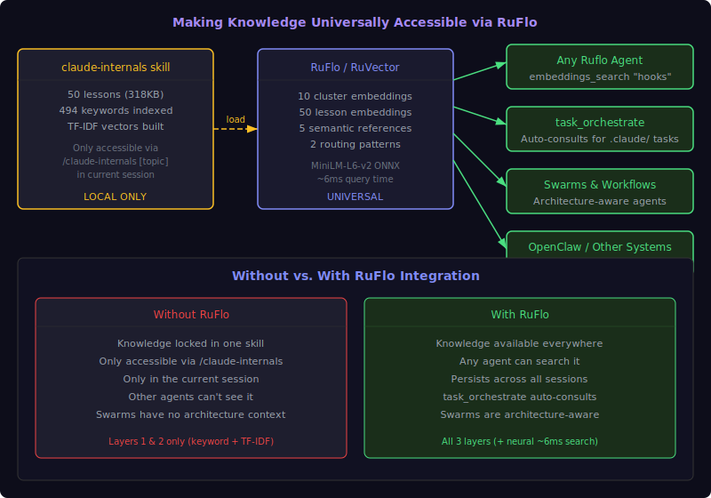

# Claude Code Internals

> A self-contained Claude Code skill that gives Claude source-level knowledge of its own architecture — 50 lessons covering every internal subsystem, searchable three ways.

**Skill Version:** 2.0.0 | **Captured from:** Claude Code v2.1.88 | **Date:** 2026-03-31 | **License:** MIT

---

## Table of Contents

- [What This Is](#what-this-is)
- [Why This Skill Is Useful](#why-this-skill-is-useful)
- [How It Works](#how-it-works)
- [Prerequisites](#prerequisites)
- [Installation](#installation--turn-this-into-your-own-local-skill)
- [Usage Examples](#usage-examples)
- [Sample Output](#sample-output)
- [Getting the Most Out of It](#getting-the-most-out-of-it)
- [RuFlo & RuVector Integration](#ruflo--ruvector-integration--universal-knowledge-access)
- [Troubleshooting](#troubleshooting)
- [What's Inside](#whats-inside)
- [Version Tracking](#version-tracking)
- [Platform Compatibility](#platform-compatibility)
- [License](#license)

---

## What This Is

This is a Claude Code skill (a local knowledge package that Claude Code loads automatically) containing a complete reverse-engineering of Claude Code's internal architecture. 50 detailed lessons cover every major subsystem — from the boot sequence to unreleased features. When you type `/claude-code-internals hooks` or `/claude-code-internals permissions`, Claude doesn't guess or hallucinate. It reads actual architecture documentation, searches through indexed reference material, and gives you source-level answers with code examples and type definitions.

Without this skill, Claude knows *how to use* Claude Code but doesn't know *how Claude Code works internally*. With it, Claude becomes an expert on its own implementation — the query engine's retry logic, the 27 hook event types, the 7-phase permission pipeline, the compaction algorithm, the agent spawn lifecycle, all of it.

## Why This Skill Is Useful

### The Core Problem

Claude Code is a powerful tool, but Claude doesn't understand its own internals. Ask it "what hook events are available?" and it'll give you a partial, sometimes wrong answer. Ask it "why did compaction eat my context?" and it'll speculate. Ask it "how do permission modes actually work?" and you'll get a general answer that misses the 23 Bash security validators and the 7-phase decision pipeline.

This is because Claude's training data doesn't include Claude Code's source code. It knows the public docs, but not the implementation details that matter when you're configuring complex behavior.

### What Changes With This Skill

- **Claude stops guessing.** Every answer comes from indexed architecture documentation, not training data. When you ask about hooks, Claude reads the actual hook system lesson that documents all 27 event types, exit code semantics, and 5 command types.

- **You get source-level depth.** Not "hooks let you run commands before and after tool use" but "PreToolUse hooks receive `{tool_name, tool_input}` as JSON on stdin, exit 0 proceeds silently, exit 1 proceeds with stderr shown to user, exit 2 blocks the tool and sends stderr to the model."

- **Configuration becomes precise.** Instead of trial-and-error when setting up agents, hooks, or permission rules, Claude can tell you exactly what fields are expected, what the valid values are, and what edge cases to watch for.

- **Debugging gets real answers.** "Why isn't my hook firing?" becomes answerable — Claude can check whether the matcher regex matches, whether the hook is in the right settings layer, whether the snapshot-capture-at-startup behavior means you need a session restart.

### Who Benefits Most

- **Claude Code power users** who configure hooks, agents, skills, and permissions
- **Developers building on Claude Code** who need to understand the agent system, coordinator mode, or MCP integration
- **Anyone debugging Claude Code behavior** who needs to understand what's happening under the hood
- **Teams using RuFlo/RuVector** who want Claude Code architecture knowledge available to all agents and workflows

## How It Works

### Architecture


<details>
<summary>ASCII Version (for AI/accessibility)</summary>

```
                    User asks: "/claude-code-internals hooks"
                                    |
                                    v
                    +-------------------------------+
                    |        SKILL.md (brain)        |
                    |   Parses topic, chooses        |
                    |   search strategy              |
                    +-------------------------------+
                                    |
                   +----------------+----------------+
                   |                |                |
                   v                v                v
          +-------------+  +---------------+  +----------------+
          | lookup.sh   |  | semantic-     |  | Ruflo Neural   |
          | (keyword)   |  | search.js     |  | (ONNX MiniLM)  |
          |             |  | (TF-IDF)      |  |                |
          | jq query    |  | cosine sim    |  | embeddings     |
          | against     |  | against       |  | search across  |
          | 494 indexed |  | 50 lesson     |  | 50 stored      |
          | keywords    |  | TF-IDF        |  | lesson vectors |
          |             |  | vectors       |  |                |
          +------+------+  +-------+-------+  +-------+--------+
                 |                 |                   |
                 v                 v                   v
          file:line refs     ranked lessons     similarity scores
                 |                 |                   |
                 +--------+-------+-------------------+
                          |
                          v
               +------------------------+
               |   Read matched section  |
               |   with offset/limit     |
               |   (only load what's     |
               |    needed)              |
               +------------------------+
                          |
                          v
               +------------------------+
               |   Synthesize answer     |
               |   < 5KB with code       |
               |   examples              |
               +------------------------+
```

</details>

### The Three Search Layers

| Layer | Script | Speed | Best For | Requires |
|-------|--------|-------|----------|----------|
| **Unified (RRF)** | `search.js` | ~60ms | **Use this by default** — combines keyword + TF-IDF via Reciprocal Rank Fusion | Node.js + `jq` |
| **1. Keyword** | `lookup.sh` | Instant | Exact terms: "hooks", "permissions", "KAIROS" | `jq` |
| **2. TF-IDF** | `semantic-search.js` | ~50ms | Natural language: "how does Claude decide what tools to use" | Node.js |
| **3. Neural** | Ruflo embeddings | ~6ms | Semantic concepts without keyword overlap | Ruflo (optional) |

- **Layer 1** uses `jq` to search a 494-keyword index mapping terms to exact file:line ranges.
- **Layer 2** tokenizes your query and computes cosine similarity against pre-built TF-IDF vectors for all 50 lessons. Pure Node.js, no dependencies.
- **Layer 3** uses MiniLM-L6-v2 sentence embeddings stored in Ruflo's vector database. This is the most powerful layer but **requires Ruflo** — see [RuFlo Integration](#ruflo--ruvector-integration--universal-knowledge-access). Without Ruflo, Layers 1 and 2 still work perfectly.

### Auto-Trigger Hook

A PreToolUse hook fires whenever Claude is about to edit files under `.claude/`. It injects a reminder into the model's context:



<details>
<summary>ASCII Version (for AI/accessibility)</summary>

```
PreToolUse hook fires on Edit/Write/Bash targeting .claude/
                            |
                            v
              +----------------------------+
              | config-aware-hook.sh       |
              | Parses tool_input JSON     |
              | Checks if path contains    |
              | .claude/                   |
              +----------------------------+
                            |
              +-------------+-------------+
              |                           |
              v                           v
        .claude/ path              Other path
        detected                   detected
              |                           |
              v                           v
        stdout: reminder           silent exit 0
        exit 0 (proceed)          (no output)
              |
              v
        Model sees:
        "Claude Code internals
         available via
         /claude-code-internals [topic]"
```

</details>

This means Claude gets a nudge to consult the architecture docs before modifying Claude Code configuration — without blocking the operation.

## Prerequisites

| Requirement | Minimum Version | Check Command | Notes |
|-------------|----------------|---------------|-------|
| **Claude Code** | v2.1.0+ | `claude --version` | Skills require a recent version |
| **Node.js** | v18+ | `node --version` | Required for Layer 2 (TF-IDF search) |
| **jq** | Any | `jq --version` | Required for Layer 1 (keyword search) |
| **Ruflo** | Latest | `npx ruflo@latest --version` | Optional — only needed for Layer 3 (neural search) |

**Install missing prerequisites:**

```bash
# macOS (Homebrew)
brew install jq node

# Ruflo (optional, for neural search)
npx ruflo@latest
```

## Installation — Turn This Into Your Own Local Skill

### Overview



<details>
<summary>ASCII Version (for AI/accessibility)</summary>

```
  +----------+    +----------+    +----------+    +----------+    +--------+
  |  1. Get  | -> | 2. mkdir | -> | 3. chmod | -> |4. Restart| -> |5. Use! |
  |  the zip |    |  + unzip |    |  scripts |    |  Claude  |    |        |
  |          |    |          |    |          |    |  Code    |    | /claude-|
  | claude-  |    | ~/.claude|    | chmod +x |    |          |    |internals|
  | internals|    | /skills/ |    | scripts/ |    | Skills   |    |  hooks  |
  | .zip     |    | claude-  |    | *.sh     |    | register |    |        |
  | (171KB)  |    | internals|    | *.js     |    | at start |    |        |
  +----------+    +----------+    +----------+    +----------+    +--------+
```

</details>

### From the Zip File (Recommended)

If someone sends you `claude-code-internals.zip`, this is all you need:

```bash
# 1. Create the skill directory
mkdir -p ~/.claude/skills/claude-code-internals

# 2. Unzip into it
cd ~/.claude/skills/claude-code-internals
unzip ~/path/to/claude-code-internals.zip

# 3. Make scripts executable
chmod +x scripts/*.sh scripts/*.js

# 4. Restart Claude Code (skills register on startup)
# Close your terminal and reopen, or start a new Claude Code session

# 5. Verify it works — type this in Claude Code:
#   /claude-code-internals hooks
# You should see a detailed response about all 27 hook events,
# exit code semantics, and configuration format. If you see
# "Unknown skill" instead, Claude Code needs a restart.
```

That's it. The zip contains everything — the SKILL.md brain, all 50 lessons, both search indexes, the lookup scripts, the README, and the LICENSE. No npm install, no server, no API keys.

### From This Repo

```bash
cp -r skill-package/* ~/.claude/skills/claude-code-internals/
```

### Activate the PreToolUse Hook (Optional)

This adds a gentle nudge whenever Claude is about to modify `.claude/` config files. Add this to the `hooks` object in `~/.claude/settings.json`:

```json
"PreToolUse": [
  {
    "matcher": "(Edit|Write|Bash)",
    "hooks": [
      {
        "type": "command",
        "command": "~/.claude/skills/claude-code-internals/scripts/config-aware-hook.sh",
        "timeout": 2000
      }
    ]
  }
]
```

> **Note:** If your `~/.claude/settings.json` doesn't have a `hooks` object yet, create one:
> ```json
> { "hooks": { "PreToolUse": [ ... ] } }
> ```
> If `settings.json` doesn't exist at all, create it with that content.

## Usage Examples

### Basic Topic Lookup

```
/claude-code-internals hooks
```
Returns all 27 hook event types, exit code semantics (0=proceed, 1=proceed+warn, 2=block), 5 command types, configuration format, and the critical detail that hook config is snapshot-captured at startup.

```
/claude-code-internals permissions
```
Returns the 7-phase permission pipeline, 5 permission modes, the 23 Bash security validators, rule matching (exact, prefix, wildcard), rule sources and priority order, auto-mode fast paths, and bypass mode limitations.

### Natural Language Questions

```
/claude-code-internals how does context compaction work
```
Returns the compaction algorithm, token thresholds, microcompact vs full compaction, what gets preserved vs summarized, and how to avoid losing important context.

### Debugging Scenarios

```
/claude-code-internals why isn't my hook firing
```
Surfaces: Hook config is snapshot-captured once at startup (changes mid-session don't take effect), matcher regex must match the tool name, PreToolUse vs PostToolUse timing, and the exit code contract.

### Configuration Reference

```
/claude-code-internals settings cascade
```
Returns the 5-layer config cascade (policy > project > user > local > CLI), Zod schema validation, chokidar file watching, and how layers merge.

### When Keyword Search Fails, TF-IDF Succeeds

```
/claude-code-internals what happens when Claude runs out of context space
```
The keyword "compaction" doesn't appear in the query, but the TF-IDF layer matches it to the Context Compaction lesson because of overlapping terms like "context" and the semantic structure of the question.

## Sample Output

Here's what the search layers actually return:

**Keyword lookup** (`lookup.sh hooks`):
```
claude-code-deep-dive-all-10-lessons.md:236:501 "Query Engine & LLM API"
claude-code-deep-dive-all-10-lessons.md:1032:1261 "Architecture Overview (Capstone)"
claude-code-deep-dive-batch2-10-lessons.md:324:456 "Hooks System"
```

**TF-IDF search** (`semantic-search.js "how does context compaction work"`):
```
Query: "how does context compaction work"
Tokens: [context, compaction, work]
============================================================

  1. Context Compaction (Lesson 28)
     Score: 0.2256  #########
     File:  claude-code-deep-dive-lessons.md:952-1040
     Keywords: compaction, context-window, microcompact, summarization, token-management

  2. Architecture Overview (Capstone) (Lesson 5)
     Score: 0.0816  ###
     File:  claude-code-deep-dive-all-10-lessons.md:1032-1261
     Keywords: architecture, capstone, data-flow, timeline, overview

  3. MCP System (Lesson 10)
     Score: 0.0591  ##
     File:  claude-code-deep-dive-all-10-lessons.md:2105-2207
     Keywords: mcp, model-context-protocol, oauth, transport, elicitation
```

The skill then reads the matched section with exact line offsets and synthesizes a focused answer under 5KB.

## Getting the Most Out of It

1. **Use it BEFORE configuring anything under `.claude/`.** The skill knows exact formats, valid values, and edge cases. This eliminates the trial-and-error cycle of "change config, restart, test, find out it doesn't work, repeat."

2. **Use natural language when keywords don't work.** If "compaction" doesn't find what you need, try "what happens when Claude runs out of context space" — the TF-IDF layer handles fuzzy matching.

3. **Know its limits.** This is captured from Claude Code **v2.1.88**. If Claude Code has updated, some internals may have changed. The `check-version.sh` script detects this automatically.

## Smart Features (v2.0)

### Unified Search (Reciprocal Rank Fusion)

Instead of choosing between keyword search and TF-IDF, `search.js` runs both and merges results using [Reciprocal Rank Fusion](https://plg.uwaterloo.ca/~gvcormac/cormacksigir09-rrf.pdf) — a proven technique from information retrieval that consistently outperforms either individual ranker.

```bash
node scripts/search.js "hook events"
# Returns: Hooks System [HIGH - both layers], plus related lessons
```

Results are labeled with confidence:
- **HIGH** — Both keyword and TF-IDF agree this is a top match
- **MEDIUM** — One layer ranks it highly
- **LOW** — Appears in lower ranks only

### Version Staleness Detection

The skill automatically warns when Claude Code has updated past the captured version:

```bash
bash scripts/check-version.sh
# Silent if versions match
# Warns: "captured from v2.1.88 but you are running vX.Y.Z"
```

### Troubleshooting Index

25 common problems mapped to relevant lessons with one-line hints:

```bash
# When the skill sees a debugging query like "hook not firing", it checks
# troubleshooting.json and surfaces:
#   Hint: Hook config is snapshot-captured at startup. Restart Claude Code.
#   → Lessons: 32 (Hooks), 26 (Settings), 1 (Boot Sequence)
```

### Cross-Reference Map

200 lesson-to-lesson connections enable multi-topic synthesis. When you ask "how do hooks interact with permissions?", the skill reads both the Hooks lesson AND the Permissions lesson because the cross-reference map links them (relevance: 0.85).

## RuFlo & RuVector Integration — Universal Knowledge Access



<details>
<summary>ASCII Version (for AI/accessibility)</summary>

```
  +-------------------+         +-------------------+         +--------------------+
  | claude-code-internals  |  load   |  RuFlo / RuVector |  query  | Any Ruflo Agent    |
  | skill (LOCAL)     | ------> |  (UNIVERSAL)      | ------> | task_orchestrate   |
  |                   |         |                   |         | Swarms & Workflows |
  | 50 lessons        |         | 10 cluster embeds |         | OpenClaw           |
  | 494 keywords      |         | 50 lesson embeds  |         | Other Systems      |
  | TF-IDF vectors    |         | 5 semantic refs   |         |                    |
  |                   |         | 2 routing patterns |         |                    |
  +-------------------+         +-------------------+         +--------------------+
        LOCAL ONLY                   UNIVERSAL                  EVERYTHING BENEFITS
  (only /claude-code-internals)    (any agent, any session)     (architecture-aware agents)
```

</details>

The skill works standalone with Layers 1 and 2. But to make Claude Code architecture knowledge **universally accessible** to all agents, swarms, workflows, and task orchestration, you can load it into RuFlo and RuVector. This enables:

- **Any Ruflo agent** can search Claude Code internals via embeddings (not just the `/claude-code-internals` skill)
- **`task_orchestrate`** automatically consults the knowledge when routing tasks involving `.claude/` configuration
- **Swarms and workflows** can access architecture knowledge without needing the skill loaded
- **OpenClaw and other systems** can query the knowledge via the `claude-code-internals` namespace

### Step 1: Load Cluster Embeddings (10 High-Level Summaries)

This stores 10 thematic clusters covering the major architecture areas:

```bash
# From the skill directory
cd ~/.claude/skills/claude-code-internals

# Generate and store embeddings via Ruflo
# (requires Ruflo MCP server running)
node scripts/build-rvf-index.js
```

Or manually via Ruflo MCP tools:

```
# Store embeddings for each architecture area
embeddings_generate  text="Boot sequence, query engine, state management, system prompt assembly..."  namespace=claude-code-internals
embeddings_generate  text="Tool system, bash security validators, file tools, search tools, MCP..."  namespace=claude-code-internals
# ... repeat for all 10 clusters
```

### Step 2: Load Granular Lesson Embeddings (50 Individual Lessons)

This gives Ruflo precise per-lesson search capability:

```
# Store each lesson summary individually
memory_store  key="lesson-01-boot-sequence"  value="Claude Code boot sequence: CLI arg parsing, config cascade, MCP init..."  namespace=claude-code-internals-lessons
memory_store  key="lesson-02-query-engine"  value="Query engine: streaming SSE, retry logic, continuation, while loop..."  namespace=claude-code-internals-lessons
# ... repeat for all 50 lessons
```

### Step 3: Add AgentDB Semantic References

Store high-level reference entries so Ruflo's semantic router knows this knowledge exists:

```
agentdb_hierarchical-store  key="claude-code-internals-hooks"  value="27 hook events, exit codes, PreToolUse/PostToolUse, command types"  level=reference  namespace=claude-code-internals
agentdb_hierarchical-store  key="claude-code-internals-permissions"  value="7-phase pipeline, 5 modes, 23 Bash validators, rule matching"  level=reference  namespace=claude-code-internals
# ... repeat for 5 core areas
```

### Step 4: Add Routing Patterns for Task Orchestration

Tell `task_orchestrate` to auto-consult this namespace for Claude Code config tasks:

```
memory_store  key="routing-claude-config"  value="When task involves .claude/ config, hooks, agents, skills, or permissions: search namespace=claude-code-internals first"  namespace=task-routing
memory_store  key="routing-claude-debug"  value="When debugging Claude Code behavior: search namespace=claude-code-internals-lessons for relevant lesson"  namespace=task-routing
```

### Step 5: Verify It's Working

```
# Test cluster search
embeddings_search  query="agent swarm"  namespace=claude-code-internals
# Expected: top hit should be agents/swarm cluster with similarity > 0.65

# Test lesson search
embeddings_search  query="hook exit codes"  namespace=claude-code-internals-lessons
# Expected: Hooks System lesson with similarity > 0.70

# Test semantic reference
agentdb_hierarchical-recall  query="permissions"  namespace=claude-code-internals
# Expected: permissions reference entry
```

### What Each Namespace Provides

| Namespace | Entries | Purpose | Query Speed |
|-----------|---------|---------|-------------|
| `claude-code-internals` | 10 clusters | High-level topic routing | ~6ms |
| `claude-code-internals-lessons` | 50 lessons | Precise lesson-level search | ~6ms |
| `task-routing` | 2 patterns | Auto-consultation by `task_orchestrate` | N/A (routing) |
| AgentDB references | 5 entries | Semantic router awareness | ~10ms |

## Troubleshooting

**"Unknown skill" when typing `/claude-code-internals`**
Skills register at startup. Restart Claude Code (close terminal, reopen) and try again.

**`lookup.sh` fails with "command not found: jq"**
Install jq: `brew install jq` (macOS) or `apt-get install jq` (Linux).

**`semantic-search.js` fails or returns no results**
Check Node.js version: `node --version` (requires v18+). If the file isn't executable: `chmod +x scripts/semantic-search.js`.

**Hook doesn't fire when editing `.claude/` files**
Hook config is snapshot-captured once at startup. If you just added the hook to `settings.json`, restart Claude Code. Also verify the script path is correct and the script is executable: `chmod +x scripts/config-aware-hook.sh`.

**Layer 3 (neural search) doesn't work**
Layer 3 requires Ruflo with the `claude-code-internals` namespace populated. See [RuFlo Integration](#ruflo--ruvector-integration--universal-knowledge-access). Layers 1 and 2 work without Ruflo.

**Search returns the wrong lesson**
Try a different query phrasing. Layer 1 (keyword) is exact-match only. Layer 2 (TF-IDF) works better with natural language. If both miss, the topic may span multiple lessons — try broader terms.

## What's Inside

<details>
<summary>Directory Structure (click to expand)</summary>

```
claude-code-internals-skill/
|
+-- README.md                       This file
+-- LICENSE                         MIT license
+-- claude-code-internals.zip            Shareable package (171KB)
+-- topic-index.json                494-keyword lookup index
|
+-- skill-package/                  Mirror of installed skill
|   +-- SKILL.md                    Skill brain (search strategy + topic index)
|   +-- version.json                Version tracking (v2.1.88)
|   +-- hooks-config.json           PreToolUse hook definition
|   +-- references/                 Source material
|   |   +-- 01-core-architecture-tools.md
|   |   +-- 02-agents-intelligence-interface.md
|   |   +-- 03-interface-infrastructure.md
|   |   +-- 04-connectivity-plugins.md
|   |   +-- 05-unreleased-bigpicture.md
|   |   +-- topic-index.json        Keyword index (494 entries)
|   |   +-- semantic-index.json     TF-IDF vectors (50 lessons)
|   +-- scripts/
|       +-- lookup.sh               Keyword search (jq)
|       +-- semantic-search.js      TF-IDF search (Node.js)
|       +-- build-rvf-index.js      RVF/TF-IDF index builder
|       +-- config-aware-hook.sh    PreToolUse .claude/ detector
|
+-- assets/diagrams/                SVG diagrams for this README
+-- .ascii-to-svg-manifest.json     Diagram change tracking
+-- .gitignore
+-- .gitmodules
```

</details>

<details>
<summary>The 50 Lessons — 8 Chapters (click to expand)</summary>

| Ch | File | Lessons |
|----|------|---------|
| 1-2 | `01-core-architecture-tools.md` | Boot Sequence, Query Engine, State Management, System Prompt, Architecture Overview, Tool System, Bash Tool, File Tools, Search Tools, MCP System |
| 3-4 | `02-agents-intelligence-interface.md` | Skills System, Agent System, Coordinator Mode, Teams/Swarm, Memory System, Auto-Memory/Dreams, Ink Renderer, Commands System, Dialog/UI, Notifications |
| 4-5 | `03-interface-infrastructure.md` | Vim Mode, Keybindings, Fullscreen, Theme/Styling, Permissions, Settings/Config, Session Management, Context Compaction, Analytics/Telemetry, Migrations |
| 5-6 | `04-connectivity-plugins.md` | Plugin System, Hooks System, Error Handling, Bridge/Remote, OAuth, Git Integration, Upstream Proxy, Cron/Scheduling, Voice System, BUDDY Companion |
| 7-8 | `05-unreleased-bigpicture.md` | ULTRAPLAN, Entrypoints/SDK, KAIROS Always-On, Cost Analytics, Desktop App, Model System, Sandbox/Security, Message Processing, Task System, REPL Screen |

</details>

### What's in the Zip

The `claude-code-internals.zip` file is the complete, shareable package. It contains everything needed to install and use the skill:

| File | Size | Purpose |
|------|------|---------|
| `SKILL.md` | 8KB | The skill brain — search strategy, topic index, response format |
| `README.md` | — | This documentation |
| `LICENSE` | — | MIT license |
| `version.json` | 380B | Version tracking (v2.1.88) |
| `hooks-config.json` | 1.4KB | PreToolUse hook definition (portable paths) |
| `references/*.md` | 318KB | 5 lesson files containing all 50 architecture lessons |
| `references/topic-index.json` | 27KB | 494-keyword lookup index |
| `references/semantic-index.json` | 99KB | Pre-built TF-IDF vectors for all 50 lessons |
| `scripts/lookup.sh` | 1.2KB | Keyword search (requires `jq`) |
| `scripts/semantic-search.js` | 6.9KB | TF-IDF search (requires Node.js 18+) |
| `scripts/search.js` | 17KB | **Unified RRF search** — keyword + TF-IDF fused (use this by default) |
| `scripts/check-version.sh` | 1.4KB | Version staleness detection |
| `scripts/build-rvf-index.js` | 13.6KB | TF-IDF index builder (for rebuilding after updates) |
| `scripts/config-aware-hook.sh` | 3.5KB | PreToolUse `.claude/` path detector |
| `references/cross-references.json` | 18KB | 200 lesson-to-lesson connections for multi-topic synthesis |
| `references/troubleshooting.json` | 9KB | 25 symptom patterns with lesson pointers and hints |

## Version Tracking

```json
{
  "captured_version": "2.1.88",
  "captured_date": "2026-03-31",
  "source": "https://www.markdown.engineering/learn-claude-code/"
}
```

When Claude Code updates beyond v2.1.88, the internals knowledge may be stale. To update:

1. Re-download lessons from the source
2. Replace the files in `references/`
3. Run `node scripts/build-rvf-index.js` to rebuild the TF-IDF index
4. Update `version.json` with the new version
5. If using Ruflo, re-run the embedding steps from the [RuFlo Integration](#ruflo--ruvector-integration--universal-knowledge-access) section

## Platform Compatibility

| Platform | Status | Notes |
|----------|--------|-------|
| **macOS** | Fully tested | Primary development platform |
| **Linux** | Expected to work | Uses standard bash, jq, Node.js |
| **Windows (WSL)** | Expected to work | Run inside WSL, not native Windows |
| **Windows (native)** | Not supported | Bash scripts require a Unix shell |

## License

MIT License. See [LICENSE](LICENSE) for full text.

The architecture lesson content in `references/` is sourced from [markdown.engineering](https://www.markdown.engineering/learn-claude-code/) and is used for educational and tooling purposes. The skill packaging, indexes, search scripts, and hook integrations are original work.
