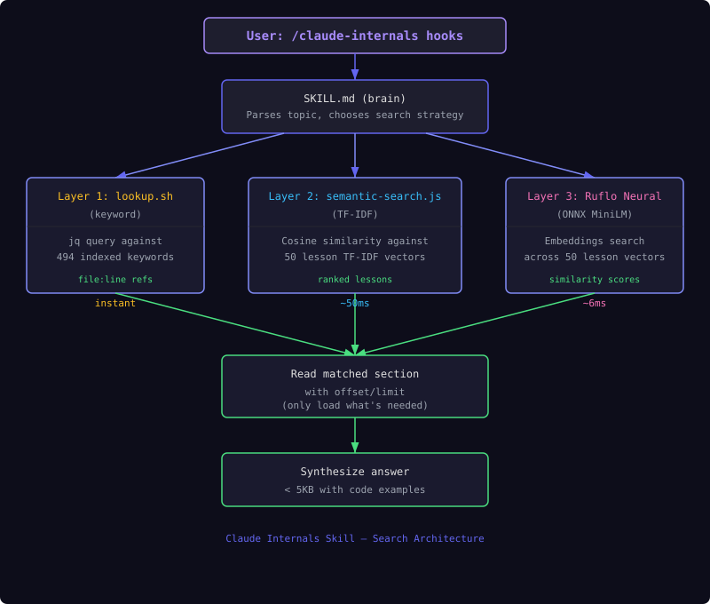

# Claude Code Internals


> A self-contained Claude Code skill that gives Claude source-level knowledge of its own architecture — 169 lessons covering every internal subsystem, verified against the v2.1.231 binary and six further artifact classes (the Claude Desktop `app.asar`, the Desktop-managed host agent Mach-O, the Cowork in-VM agent ELF, the golden Cowork VM disk image, the live GrowthBook `fcache`, and Desktop's Chromium HTTP cache), searchable three ways.
>
> **This is a modified fork** of [stuinfla/claude-code-internals](https://github.com/stuinfla/claude-code-internals). See [Attribution](#attribution) for what changed.

[](https://yaniv-golan.github.io/claude-code-internals/static/install-claude-desktop.html)

[](https://opensource.org/licenses/MIT)
[](https://docs.anthropic.com/en/docs/agents-and-tools/claude-code/plugins)
[](https://github.com/yaniv-golan/skill-creator-plus)

**Skill Version:** 2.43.0 | **Captured from:** Claude Code v2.1.231 (+ Claude Desktop app.asar through 1.30096.1 + Desktop-managed host agent Mach-O 2.1.229 + in-VM ELF claude-code-vm/2.1.170 / 2.1.197 / 2.1.205 + the golden Cowork VM disk image `rootfs.img` + live `fcache` decodes + Desktop's Chromium HTTP cache) | **Date:** 2026-08-14 | **License:** MIT

---

## Installation

### Claude Desktop

[](https://yaniv-golan.github.io/claude-code-internals/static/install-claude-desktop.html)

*— or install manually —*

1. Click **Customize** in the sidebar
2. Click **Browse Plugins**
3. Go to the **Personal** tab and click **+**
4. Choose **Add marketplace**
5. Type `yaniv-golan/claude-code-internals` and click **Sync**

### Claude Code (CLI)

```bash
claude plugin marketplace add https://github.com/yaniv-golan/claude-code-internals
claude plugin install claude-code-internals@claude-code-internals-marketplace
```

Or from within a Claude Code session:

```
/plugin marketplace add yaniv-golan/claude-code-internals
/plugin install claude-code-internals@claude-code-internals-marketplace
```

### Claude.ai (Web)

1. Download [`claude-code-internals.zip`](https://github.com/yaniv-golan/claude-code-internals/releases/latest/download/claude-code-internals.zip)
2. Click **Customize** in the sidebar
3. Go to **Skills** and click **+**
4. Choose **Upload a skill** and upload the zip file

### Manus

1. Download [`claude-code-internals.zip`](https://github.com/yaniv-golan/claude-code-internals/releases/latest/download/claude-code-internals.zip)
2. Go to **Settings** → **Skills** → **+ Add** → **Upload**

### ChatGPT

1. Download [`claude-code-internals.zip`](https://github.com/yaniv-golan/claude-code-internals/releases/latest/download/claude-code-internals.zip)
2. Upload at [chatgpt.com/skills](https://chatgpt.com/skills)

> ChatGPT Skills are currently in beta, available on Business, Enterprise, Edu, and Healthcare plans.

### Codex CLI

```
$skill-installer https://github.com/yaniv-golan/claude-code-internals
```

Or manually: download the zip, extract the contents to `~/.codex/skills/claude-code-internals/`.

### From This Repo (manual)

```bash
cp -r skill-package/skills/claude-code-internals/* ~/.claude/skills/claude-code-internals/
chmod +x ~/.claude/skills/claude-code-internals/scripts/*.sh \
         ~/.claude/skills/claude-code-internals/scripts/*.js
```

### Activate the PreToolUse Hook (Optional)

Adds a gentle reminder whenever Claude edits `.claude/` config files. Add to `hooks` in `~/.claude/settings.json`:

```json
"PreToolUse": [
  {
    "matcher": "(Edit|Write|Bash)",
    "hooks": [
      {
        "type": "command",
        "command": "~/.claude/plugins/claude-code-internals/skills/claude-code-internals/scripts/config-aware-hook.sh",
        "timeout": 2000
      }
    ]
  }
]
```

---

## Table of Contents

- [What This Is](#what-this-is)
- [Why This Skill Is Useful](#why-this-skill-is-useful)
- [How It Works](#how-it-works)
- [Prerequisites](#prerequisites)
- [Usage Examples](#usage-examples)
- [Sample Output](#sample-output)
- [Getting the Most Out of It](#getting-the-most-out-of-it)
- [RuFlo & RuVector Integration](#ruflo--ruvector-integration--universal-knowledge-access)
- [Troubleshooting](#troubleshooting)
- [What's Inside](#whats-inside)
- [Version Tracking](#version-tracking)
- [Platform Compatibility](#platform-compatibility)
- [Attribution](#attribution)
- [License](#license)

---

## What This Is

This is a Claude Code skill containing a complete reverse-engineering of Claude Code's internal architecture, verified against the v2.1.231 binary. **169 detailed lessons across 46 chapters** cover every major subsystem — from the boot sequence to undocumented features found directly in the binary. See [the full chapter table](#whats-inside) for the lesson-by-lesson breakdown.

The material falls into four strands:

- **Chapters 1–8 (L1–L50)** — the core architecture: boot sequence, query engine, tool system, permissions, hooks, agents, MCP, memory, compaction, sessions, OAuth.
- **Chapters 9–21, 27, 38 (CLI binary diffs)** — what actually changed release to release, extracted from the Bun SEA binary and cross-checked against the official changelog. The delta between the two *is* the finding: this is where dark-launched features surface (Claude Design, Artifacts, Launch Composer) alongside announced ones.
- **Chapters 22–26, 28–37, 39 (Claude Desktop + Cowork)** — the Desktop `app.asar`, the Cowork spawn and stream-json control protocol, the host-loop/VM-loop split, sub-agent execution, mount and delete semantics, skill-discovery tooling, and the two execution lanes. Verified across six artifact classes, several of which no single binary contains.
- **[`references/state/`](skill-package/skills/claude-code-internals/references/state/)** — a mutable "as of version X" truth layer over the append-only lesson chapters, tracking enumerable facts (env vars, gates, commands, tools, IPC interfaces, control-protocol subtypes) with per-entry provenance, validated by its own schema checker and reconciliation audit.

When you type `/claude-code-internals hooks` or `/claude-code-internals permissions`, Claude doesn't guess or hallucinate. It reads actual architecture documentation, searches through indexed reference material, and gives you source-level answers with code examples and type definitions.

Without this skill, Claude knows *how to use* Claude Code but doesn't know *how Claude Code works internally*. With it, Claude becomes an expert on its own implementation — the query engine's retry logic, all 31 hook event types, the 7-phase permission pipeline, the compaction algorithm, the agent spawn lifecycle, and binary-verified internals of features like `/effort`, `/rewind`, `/teleport`, `/branch`, Dynamic Workflows, the Opus 4.8 effort ladder, the Cowork runtime, and `/fork`.

## Why This Skill Is Useful

### The Core Problem

Claude Code is a powerful tool, but Claude doesn't understand its own internals. Ask it "what hook events are available?" and it'll give you a partial, sometimes wrong answer. Ask it "why did compaction eat my context?" and it'll speculate. Ask it "how do permission modes actually work?" and you'll get a general answer that misses the 23 Bash security validators and the 7-phase decision pipeline.

### What Changes With This Skill

- **Claude stops guessing.** Every answer comes from indexed architecture documentation, not training data.
- **You get source-level depth.** Not "hooks let you run commands before and after tool use" but "PreToolUse hooks receive `{tool_name, tool_input}` as JSON on stdin, exit 0 proceeds silently, exit 1 proceeds with stderr shown to user, exit 2 blocks the tool and sends stderr to the model."
- **Configuration becomes precise.** Exact fields, valid values, and edge cases — no trial-and-error.
- **Debugging gets real answers.** "Why isn't my hook firing?" becomes answerable: hook config is snapshot-captured at startup, and the matcher regex must match the tool name exactly.

### Who Benefits Most

- **Claude Code power users** who configure hooks, agents, skills, and permissions
- **Developers building on Claude Code** who need to understand the agent system, coordinator mode, or MCP integration
- **Anyone debugging Claude Code behavior** who needs to understand what's happening under the hood

## How It Works

### Architecture



<details>
<summary>ASCII Version (for AI/accessibility)</summary>

```
                    User asks: "/claude-code-internals hooks"
                                    |
                                    v
                    +-------------------------------+
                    |        SKILL.md (brain)        |
                    |   Parses topic, chooses        |
                    |   search strategy              |
                    +-------------------------------+
                                    |
                   +----------------+----------------+
                   |                |                |
                   v                v                v
          +-------------+  +---------------+  +----------------+
          | lookup.sh   |  | semantic-     |  | fetch-lesson.js|
          | (keyword)   |  | search.js     |  | (by lesson ID) |
          |             |  | (TF-IDF)      |  |                |
          | jq query    |  | cosine sim    |  | xref.js        |
          | against 3286|  | against 142   |  | troubleshoot.js|
          | keywords    |  | lesson TF-IDF |  |                |
          +------+------+  +-------+-------+  +-------+--------+
                 |                 |                   |
                 +--------+--------+-------------------+
                          |
                          v
               +------------------------+
               |  fetch-lesson.js <id>   |
               |  returns content with   |
               |  no offset math needed  |
               +------------------------+
                          |
                          v
               +------------------------+
               |   Synthesize answer     |
               |   < 5KB with code       |
               |   examples              |
               +------------------------+
```

</details>

### The Search Layers

| Layer | Script | Best For |
|-------|--------|----------|
| **Unified (RRF)** | `search.js` | **Default** — combines keyword + TF-IDF via Reciprocal Rank Fusion |
| **Keyword** | `lookup.sh` | Exact terms: "hooks", "permissions", "KAIROS" |
| **TF-IDF** | `semantic-search.js` | Natural language: "how does Claude decide what tools to use" |

After search, `fetch-lesson.js <id>` retrieves the lesson content directly — no file path or line offset tracking required.

### Auto-Trigger Hook

A PreToolUse hook fires whenever Claude is about to edit files under `.claude/`. It injects a reminder into the model's context, nudging Claude to consult the architecture docs before modifying Claude Code configuration.

## Prerequisites

| Requirement | Minimum | Check | Notes |
|-------------|---------|-------|-------|
| **Claude Code** | v2.1.0+ | `claude --version` | Skills require a recent version |
| **Node.js** | v18+ | `node --version` | Required for TF-IDF search and fetch-lesson |
| **jq** | Any | `jq --version` | Required for keyword search |

```bash
# macOS (Homebrew)
brew install jq node
```

## Usage Examples

```
/claude-code-internals hooks
```
Returns all 31 hook event types, exit code semantics (0=proceed, 1=proceed+warn, 2=block), command types, configuration format, and the critical detail that hook config is snapshot-captured at startup.

```
/claude-code-internals permissions
```
Returns the 7-phase permission pipeline, 6 permission modes (`default`, `plan`, `acceptEdits`, `bypassPermissions`, `auto`, `dontAsk`), the 23 Bash security validators, and rule matching logic.

```
/claude-code-internals why isn't my hook firing
```
Surfaces: startup snapshot-capture, matcher regex matching, exit code contract.

```
/claude-code-internals /effort
```
Returns the effort ladder (`low` / `medium` / `high` / `xhigh` / `max`), the `effortLevel` settings key, the `CLAUDE_CODE_EFFORT_LEVEL` env var, and the caveat that Claude Desktop resolves effort from a local settings-file object rather than that env var.

```
/claude-code-internals why did rm fail in Cowork
```
Returns the per-mount FUSE delete policy: exactly `unlink` and `rmdir` are denied, `truncate` and rename are not, approval via `allow_cowork_file_delete` is per-mount and takes effect live with no remount.

## Sample Output

**Unified RRF search** (`search.js "hook events"`):
```
[HIGH] Hooks System (L32)  04-connectivity-plugins.md L324–456
[HIGH] Hook event types (L10) cross-ref via permissions
[MED]  Settings/Config (L30)  startup snapshot behavior
```

**fetch-lesson** (`fetch-lesson.js 32`):
```
# Lesson 32: Hooks System
# Source: 04-connectivity-plugins.md L324–456

[full lesson content with type definitions, exit code table,
 all 31 event types, configuration examples...]
```

## Getting the Most Out of It

1. **Use it BEFORE configuring anything under `.claude/`.** The skill knows exact formats, valid values, and edge cases.
2. **Use natural language when keywords don't work.** "what happens when Claude runs out of context space" finds the compaction lesson even without the word "compaction."
3. **Know its limits.** Core lessons (1–50) were captured from Claude Code v2.1.88. Chapters 9–46 (lessons 51–169) were verified directly against the v2.1.90 through v2.1.231 binaries (plus Claude Desktop `app.asar`, the Desktop-managed host agent, the Cowork in-VM ELF/disk image, and the live `fcache` for the Desktop- and Cowork-specific chapters).

## Smart Features

### Unified Search (Reciprocal Rank Fusion)

`search.js` runs keyword + TF-IDF in parallel and merges results using RRF — results labeled **HIGH** (both layers agree), **MEDIUM** (one layer), or **LOW**.

### fetch-lesson.js — No Offset Math

```bash
node scripts/fetch-lesson.js 32          # Hooks System content
node scripts/fetch-lesson.js 32 --meta   # Metadata only (file, line range)
node scripts/fetch-lesson.js --list      # All 169 lessons
```

### xref.js — Shell-Safe Cross-Reference Lookup

```bash
node scripts/xref.js 10 29    # Related lessons for hooks + permissions
```

### troubleshoot.js — Shell-Safe Troubleshooting

```bash
node scripts/troubleshoot.js "hook not firing after restart"
# → Hint: Hook config snapshot-captured at startup → Lessons L32, L30, L1
```

### Maintenance Scripts (for contributors)

```bash
# Extract JS bundle from any Claude Code binary
bash scripts/extract-bundle.sh ~/.local/share/claude/versions/2.1.96

# Structured diff between two bundle versions
bash scripts/diff-versions.sh claude-2.1.88-bundle.js claude-2.1.90-bundle.js
```

### Version Staleness Detection

```bash
bash scripts/check-version.sh
# Silent if versions match (reads captured_version from version.json — currently v2.1.231)
# Warns if you are running a newer version
```

## RuFlo & RuVector Integration — Universal Knowledge Access

The skill works standalone. To make Claude Code architecture knowledge accessible to all agents, swarms, and task orchestration, load it into RuFlo and RuVector:

```bash
# Generate and store embeddings via Ruflo
cd ~/.claude/skills/claude-code-internals
node scripts/build-rvf-index.js
```

This generates `references/semantic-index.json`, the TF-IDF layer `semantic-search.js` and `search.js` both read.

## Troubleshooting

**"Unknown skill" when typing `/claude-code-internals`**
Skills register at startup. Restart Claude Code and try again.

**`lookup.sh` fails with "command not found: jq"**
Install jq: `brew install jq` (macOS) or `apt-get install jq` (Linux).

**`fetch-lesson.js` or `semantic-search.js` fails**
Check Node.js: `node --version` (requires v18+). Make scripts executable: `chmod +x scripts/*.js scripts/*.sh`.

**Hook doesn't fire when editing `.claude/` files**
Hook config is snapshot-captured at startup. Restart Claude Code after adding the hook.

## What's Inside

<details>
<summary>Directory Structure (click to expand)</summary>

```
claude-code-internals/
├── .claude-plugin/
│   └── marketplace.json            Marketplace plugin definition
├── skill-package/                  Plugin package
│   ├── .claude-plugin/
│   │   └── plugin.json             Plugin definition
│   ├── LICENSE
│   ├── README.md
│   └── skills/
│       └── claude-code-internals/  The skill itself
│           ├── SKILL.md            Skill brain (search strategy, lesson index)
│           ├── version.json        Version tracking (v2.43.0 / v2.1.231)
│           ├── hooks-config.json   PreToolUse hook definition
│           ├── references/
│           │   ├── 01-core-architecture-tools.md
│           │   ├── 02-agents-intelligence-interface.md
│           │   ├── 03-interface-infrastructure.md
│           │   ├── 04-connectivity-plugins.md
│           │   ├── 05-unreleased-bigpicture.md
│           │   ├── 06-verified-new-v2.1.90.md   ← Chapter 9 (binary-verified)
│           │   ├── 07-verified-new-v2.1.92.md   ← Chapter 10 (binary-verified)
│           │   ├── 08-verified-new-v2.1.94.md   ← Chapter 11 (binary-verified)
│           │   ├── 09-verified-new-v2.1.100.md  ← Chapter 12 (binary-verified)
│           │   ├── 10-verified-new-v2.1.101.md  ← Chapter 13 (binary-verified)
│           │   ├── 11-verified-new-v2.1.104.md  ← Chapter 14 (binary-verified)
│           │   ├── 12-verified-new-v2.1.109.md  ← Chapter 15 (binary-verified)
│           │   ├── 13-verified-new-v2.1.111.md  ← Chapter 16 (binary-verified)
│           │   ├── 14-verified-new-v2.1.113.md  ← Chapter 17 (binary-verified)
│           │   ├── 15-verified-new-v2.1.116.md  ← Chapter 18 (binary-verified)
│           │   ├── 16-verified-new-v2.1.118.md  ← Chapter 19 (binary-verified)
│           │   ├── 17-verified-new-v2.1.120.md  ← Chapter 20 (binary-verified)
│           │   ├── 18-verified-new-v2.1.159.md  ← Chapter 21 (binary-verified)
│           │   ├── 19-desktop-mcp-apps-elicitation.md      ← Chapter 22 (Desktop app.asar)
│           │   ├── 20-desktop-cli-plugin-credential-broker.md ← Chapter 23 (Desktop app.asar)
│           │   ├── 21-cowork-control-protocol.md           ← Chapter 24 (binary-verified)
│           │   ├── 22-cowork-env-gates-protocol.md         ← Chapter 25 (binary-verified)
│           │   ├── 23-cowork-spaces-tasks-checkpointing.md ← Chapter 26 (binary-verified)
│           │   ├── 24-verified-new-v2.1.198.md             ← Chapter 27 (binary-verified)
│           │   ├── 25-verified-new-v1.18286.0-desktop.md   ← Chapter 28 (Desktop app.asar)
│           │   ├── 26-subagent-resume-semantics.md         ← Chapter 29 (binary-verified)
│           │   ├── 27-skill-runtime-detection.md           ← Chapter 30 (binary-verified)
│           │   ├── 28-vm-rootfs-forensics.md               ← Chapter 31 (VM disk image forensics)
│           │   ├── 29-skill-scope-stream-contract.md       ← Chapter 32 (cross-artifact)
│           │   ├── 30-desktop-cloud-tasks-teleport-bridge.md ← Chapter 33 (Desktop app.asar)
│           │   ├── 31-desktop-reasoning-config-effort-thinking.md ← Chapter 34 (Desktop app.asar)
│           │   ├── 32-cowork-subagent-execution-model.md   ← Chapter 35 (cross-artifact)
│           │   ├── 33-desktop-device-partner-permission-tuning.md ← Chapter 36 (Desktop app.asar)
│           │   ├── 34-skill-discovery-vcs-events-containment.md ← Chapter 37 (cross-artifact)
│           │   ├── 35-verified-new-v2.1.217.md             ← Chapter 38 (binary-verified)
│           │   ├── 36-cowork-lanes-mounts-snapshot-discipline.md ← Chapter 39 (cross-artifact)
│           │   ├── 37-cowork-probe-corrections.md            ← Chapter 40 (live probes)
│           │   ├── 38-cowork-elicitation-flag-classes.md     ← Chapter 41 (cross-artifact)
│           │   ├── 39-verified-new-v2.1.231.md               ← Chapter 42 (binary-verified)
│           │   ├── 40-desktop-automemory-gates-1.30096.1.md  ← Chapter 43 (Desktop asar diff)
│           │   ├── state/                                  ← mutable "current truth" layer
│           │   │   ├── README.md
│           │   │   ├── registry.json       Structured records (env vars, gates, commands, IPC…)
│           │   │   └── *.md                One page per domain (Cowork architecture, permissions…)
│           │   ├── topic-index.json
│           │   ├── semantic-index.json
│           │   ├── cross-references.json
│           │   └── troubleshooting.json
│           └── scripts/
│               ├── fetch-lesson.js         Fetch lesson content by ID (new)
│               ├── xref.js                 Cross-reference lookup CLI (new)
│               ├── troubleshoot.js         Troubleshooting index CLI (new)
│               ├── extract-bundle.sh       Extract JS bundle from Bun SEA (new)
│               ├── diff-versions.sh        Diff env vars/commands between bundles (new)
│               ├── search.js               Unified RRF search (keyword + TF-IDF)
│               ├── semantic-search.js      TF-IDF search
│               ├── lookup.sh               Keyword search
│               ├── check-version.sh        Version staleness detection
│               ├── build-rvf-index.js      TF-IDF index builder
│               ├── state.js                Current-state lookup + --audit CLI
│               ├── validate-state.js       Schema validator for references/state/
│               ├── config-aware-hook.sh    PreToolUse .claude/ detector
│               └── tests/                  Script test fixtures
├── site/                           GitHub Pages source
│   ├── index.html                  Landing page
│   ├── CNAME                       Custom domain
│   ├── generator/
│   │   ├── build.js                Static site builder
│   │   └── lint-disclosure.js      Disclosure linter
│   ├── static/
│   │   └── install-claude-desktop.html  "Add to Claude" button page
│   └── dist/                       Built output (index.html, llms.txt, cowork/, static/)
├── assets/
│   ├── banner.png
│   └── diagrams/                   architecture / hook-flow / installation-flow / ruflo-integration SVGs
├── .github/workflows/
│   ├── release.yml                 Auto-zip on tag push
│   └── deploy-site.yml             GitHub Pages deploy
└── README.md
```

> The release zip (`claude-code-internals.zip`) is built by `release.yml` on tag push and attached to the GitHub Release — it is not checked into the repo.

</details>

<details>
<summary>The 142 Lessons — 39 Chapters (click to expand)</summary>

| Ch | File | Lessons |
|----|------|---------|
| 1–2 | `01-core-architecture-tools.md` | Boot Sequence, Query Engine, State Management, System Prompt, Architecture Overview, Tool System, Bash Tool, File Tools, Search Tools, MCP System |
| 3–4 | `02-agents-intelligence-interface.md` | Skills System, Agent System, Coordinator Mode, Teams/Swarm, Memory System, Auto-Memory, Ink Renderer, Commands System, Dialog/UI, Notifications |
| 4–5 | `03-interface-infrastructure.md` | Vim Mode, Keybindings, Fullscreen, Theme/Styling, Permissions, Settings/Config, Session Management, Context Compaction, Analytics/Telemetry, Migrations |
| 5–6 | `04-connectivity-plugins.md` | Plugin System, Hooks System, Error Handling, Bridge/Remote, OAuth, Git Integration, Upstream Proxy, Cron/Scheduling, Voice System, ~~BUDDY Companion~~ (removed v2.1.97) |
| 7–8 | `05-unreleased-bigpicture.md` | ULTRAPLAN (**now released** as research preview), Entrypoints/SDK, KAIROS Always-On, Cost Analytics, Desktop App, Model System, Sandbox/Security, Message Processing, Task System, REPL Screen |
| **9** | **`06-verified-new-v2.1.90.md`** | **/effort** (reasoning budget), **/rewind** (file checkpointing), **/teleport** (session transfer), **/branch** (conversation fork), Session resume & new env vars, New commands: /autocompact ~~/buddy~~ /powerup /toggle-memory |
| **10** | **`07-verified-new-v2.1.92.md`** | v2.1.92 command changes: **/setup-bedrock**, **/stop-hook** (disabled), /tag+/vim removed (L57). New env vars: **CLAUDE_CODE_EXECPATH**, CLAUDE_REMOTE_CONTROL_SESSION_NAME_PREFIX, CLAUDE_CODE_SKIP_FAST_MODE_ORG_CHECK (L58). **AskUserQuestionTool** full documentation (L59) |
| **11** | **`08-verified-new-v2.1.94.md`** | v2.1.94 command changes: **/autofix-pr**, **/team-onboarding**, `/loop` still present (L60). New env vars: **CLAUDE_CODE_USE_MANTLE**, **CLAUDE_CODE_MCP_ALLOWLIST_ENV**, **CLAUDE_CODE_SANDBOXED**, CLAUDE_CODE_TEAM_ONBOARDING (L61) |
| **12** | **`09-verified-new-v2.1.100.md`** | **/dream** user-facing memory consolidation with 4-phase prompt, gate chain, sandboxing, team memory, tiny mode (L62). **Perforce mode** & **Script Caps** (L63). **/setup-vertex**, custom model capabilities, /buddy removal, REPL env var cleanup (L64) |
| **13** | **`10-verified-new-v2.1.101.md`** | **Proactive away summary** system with terminal focus tracking, forked API call, recap rendering (L65). **CLAUDE_CODE_CERT_STORE** CA certificate configuration (L66). **Dynamic loop pacing** with aging, cloud-first offering, /loops UI (L67). **/update** command, SDK OAuth refresh, SDK observability, MCP registry BFF (L68) |
| **14** | **`11-verified-new-v2.1.104.md`** | **Streaming Partial Yield Protection** (L70). System prompt section rename: Text Output (L71) |
| **15** | **`12-verified-new-v2.1.109.md`** | **/recap** on-demand session recap (L72). **Multi-repo checkout** & base refs (L73). **Byte-level stream watchdog** (L74). **REPL mode** (L75). v2.1.107–v2.1.109 command & env-var changes (L76) |
| **16** | **`13-verified-new-v2.1.111.md`** | **Remote Workflow Commands** /autopilot /bugfix /dashboard /docs /investigate (L77). **Advisor Tool** (server-side reviewer) (L78). **PushNotification** + KAIROS mobile push (L79). **Context Hint API** (L80). **Fullscreen TUI**, /focus, /tui (L81). Proxy Auth Helper (L82). System-prompt GB override (L83). v2.1.110–v2.1.111 changes (L84) |
| **17** | **`14-verified-new-v2.1.113.md`** | v2.1.112–v2.1.113 changes — **Remote Workflow sunset** (L85) |
| **18** | **`15-verified-new-v2.1.116.md`** | v2.1.114–v2.1.116 — **OIDC Federation** enterprise auth, config profiles, proxy plumbing, **/model headless** (L86) |
| **19** | **`16-verified-new-v2.1.118.md`** | v2.1.117 **/fork** background subagent, rate-limit/subscription overrides, /autocompact + /stop-hook removal (L87). v2.1.118 **/cost + /stats → /usage** aliases, cache-diagnosis beta, frontmatter shadow validator, WIF OAuth locking (L88) |
| **20** | **`17-verified-new-v2.1.120.md`** | **Claude Cowork runtime** GA — v2.1.119 /background, /daemon, Fleet view, classifier-summary, session-identity taxonomy (L89). v2.1.120 daemon on-demand model, **CLAUDE_CODE_LEAN_PROMPT**, memory-write Approve/Reject UX, plan-mode tripwire, CLAUDE_COWORK_MEMORY_GUIDELINES (L90). *(L89 updated v2.11.18: plugin hooks DO fire in Cowork — three-root namespace + host-loop staging.)* |
| **21** | **`18-verified-new-v2.1.159.md`** | **Dynamic Workflows** + coordinator mode (L91–92). **Opus 4.8** launch + effort ladder (L93). **Streaming tool execution GA** (L94). **MessageDisplay hook** = 30th master-array event (L95). Auto-mode promotion + repo-spoof guard (L96). **Cloud gateway** OAuth (L97). Org-managed **skills/plugins sync** (L98). Host-delegated credential refresh (L99). Background **binary takeover** + Fleet→agent-view rename (L100). **/loop keepalive** (L101). Plan-interview removal + team-memory multistore + command churn (L102). **PEWTER_OWL** over SendUserMessage (L103). ~30 codename GB-flag triage (L104) |
| **22** | **`19-desktop-mcp-apps-elicitation.md`** | Desktop `app.asar` 1.9659.4 — **MCP-Apps host bridge vs elicitation** (L105): Claude's own postMessage dialect, no `tools/call` channel, `sendPrompt`→`ui/message` into chat; elicitation returns input privately to the server — collect secrets via elicitation, never an App UI form |
| **23** | **`20-desktop-cli-plugin-credential-broker.md`** | Desktop `app.asar` 1.11847.5 + live fcache — the Cowork **CLI-plugin credential broker** (L106): `clis.*.env` set-once, safeStorage `cowork-plugin-env`, `VKr` injection, dark-launched behind gate `2307090146` (`cli_plugin`) |
| **24** | **`21-cowork-control-protocol.md`** | The Cowork **spawn + stream-json control-protocol contract** (L107): `CLAUDE_CODE_IS_COWORK`, `--permission-prompt-tool stdio`, `initialize` handshake, doubly-nested `control_response`, SDK MCP delivery, layered permissions; corrects Ch20's host-loop/VM-loop framing (gate `1143815894`) — binary-verified vs app.asar 1.12603.1 + in-VM ELF 2.1.170 + fcache |
| **25** | **`22-cowork-env-gates-protocol.md`** | Binary-verified reference catalog (L108): ~33 Cowork/Desktop env vars, the production GrowthBook gates decoded from the live fcache, and the extended control-protocol surface (`mcp_call`, `get_session_cost`, `side_question`, `Bv1`/`Uv1` dispatcher sets) |
| **26** | **`23-cowork-spaces-tasks-checkpointing.md`** | **Cowork Spaces** + **Scheduled Tasks** + **Tasks tool** + **SDK file-checkpointing** (L109): new Desktop IPC `CoworkSpaces`/`CoworkScheduledTasks`, `scheduled_task_fire` event, `CLAUDE_CODE_ENABLE_TASKS`, `rewind_files`/`file_snapshot`, ~90-subtype control protocol — binary-verified vs app.asar 1.17377.2 + in-VM ELF 2.1.197 + fcache |
| **27** | **`24-verified-new-v2.1.198.md`** | v2.1.160→v2.1.198 CLI content refresh. **Sonnet 5 = new default** (native 1M ctx, v2.1.197) + Fable 5 + `fallbackModel` 3-chain (L110). Announced surface: `/cd`, `--safe-mode`, `/config key=value`, `/rewind`-from-`/clear`, `Tool(param:value)` permissions, sub-agents 5-deep, Claude-in-Chrome GA (L111). **DARK-LAUNCHED**: **Claude Design** (`/design*`, `DesignSync`) + **Artifacts** (Artifact tool, `tengu_cobalt_plinth`) + Launch Composer + `/skill-doctor` + `/pause-memory` (L112). Memory→knowledge-base + 4 new API betas (L113) |
| **28** | **`25-verified-new-v1.18286.0-desktop.md`** | Desktop `app.asar` **1.18286.0** re-verification (L114): every Ch23–Ch26 mechanism structurally unchanged (`cli_plugin` gate still off); corrects Ch24/L107's "`--effort medium`" claim to a real `LocalSessions.setEffort/getEffort` IPC family backed by `CLAUDE_CODE_EFFORT_LEVEL`; promotes `CLAUDE_CODE_SUBAGENT_MODEL` to confirmed-wired; new surface: `CLAUDE_CODE_QUESTION_PREVIEW_FORMAT`, `CLAUDE_CODE_ENABLE_ASK_USER_QUESTION_TOOL`, `CLAUDE_COWORK_MEMORY_PATH_OVERRIDE`, three new `mcp__cowork__*` tools |
| **29** | **`26-subagent-resume-semantics.md`** | **Subagent resume semantics** (L115): `Task` is one-shot per call everywhere (no resume parameter), but the standalone CLI resumes completed/stopped background agents via `SendMessage({to: <agentId>})` → `resumeAgentBackground` (disk-transcript reload); Cowork severs the path at spawn (`SendMessage` omitted, `CLAUDE_CODE_DISABLE_BACKGROUND_TASKS=1`, Desktop `Task` hook) — binary-verified vs CLI 2.1.198 + app.asar 1.18286.0 |
| **30** | **`27-skill-runtime-detection.md`** | **Skill runtime detection** (L116): CLI vs Cowork vs elsewhere — host-loop Cowork splits a skill across a host-side agent process and a **sealed-env VM shell** with no `CLAUDE_CODE_*` markers, so a bare env check false-negatives in production Cowork; ordered detection recipe (`$CLAUDE_CODE_IS_COWORK` → cwd `/sessions/<id>` → `$CLAUDECODE`/`CLAUDE_CODE_ENTRYPOINT` → else) |
| **31** | **`28-vm-rootfs-forensics.md`** | **VM rootfs forensics** (L117): direct inspection of the golden Cowork VM disk image (`rootfs.img`) — full per-session mount inventory (`outputs`/`uploads`/`.claude`/connected-folders, each a `sessions-<slug>-mnt-<name>.mount` unit) with the key negative result that home and `/tmp` have **no** mount unit; confirms Docker-style session-slug format; surfaces the in-guest `coworkd` daemon. v2.23.0 addendum: the `.host-home` mount name is a dark-gated synthetic path-translation index, not a real bind mount |
| **32** | **`29-skill-scope-stream-contract.md`** | **Skill-scope attribution & the per-`tool_use` stream contract** (L118): the agent tracks an internal `activeSkill` scope (inline = sticky/no-pop, fork restores it in a `finally`) and threads an `attribution` bundle onto every **outbound API request** — but that scope is **absent from the local stream**, whose per-`tool_use` envelope is a small set of always-present + conditional fields (`tool_use_meta` is display-only). No exact tool→skill attribution in the stream; **fork** skills excepted (`parent_tool_use_id` = the `Skill` id, currently undercounted in `toolCounts`). Also pins `microcompact_boundary` (0 stream producers — render-only). Cross-artifact first-party vs in-VM ELF 2.1.197 + host CLI 2.1.201 + app.asar 1.18286.0 |
| **33** | **`30-desktop-cloud-tasks-teleport-bridge.md`** | **Desktop cloud tasks** (L119): `teleportToCloud` traced (3 progress events, absolute `claude.ai/code/<id>` URL); **zero IPC interface diff** 1.18286.2→1.19367.0 — cloud tasks are *not* new; central finding: `CLAUDE_CODE_ENVIRONMENT_KIND=bridge` **is** the bridge-session worker mechanism, set by the agent's own `claude remote-control` poll/ack/stop client when spawning children, **never** assigned by the Desktop |
| **34** | **`31-desktop-reasoning-config-effort-thinking.md`** | **Desktop reasoning config** (L120): extended thinking is a strict boolean (`maxThinkingTokens` = exactly 31999 or 0, CLI flags only, never spawn env); effort is a per-model enum over four model-config classes resolving **exclusively from a local settings-file object** and **never** from `CLAUDE_CODE_EFFORT_LEVEL` — correcting Ch28/L114's backing-store claim; `setEffort` → `applyFlagSettings({effortLevel})` |
| **35** | **`32-cowork-subagent-execution-model.md`** | **Cowork sub-agent execution model** (L121–L124): the `GY` six-step tool-composition rule + the type-less `general-purpose tools:["*"]` fallback (fired in 113/509 real production dispatches); sub-agents are **in-process**, cwd **is** the session outputs dir, `/sessions/…` always denied for file tools; the `subagent_env_hl`/`subagent_env_vm` prompt append is **inert** without `CLAUDE_CODE_ENABLE_APPEND_SUBAGENT_PROMPT`; model/ToolSearch chains, `run_in_background` polarity flip, resume-sticky host-loop gate. **Methodology: the fcache is gzip-wrapped** (`tail -c +9 \| gunzip`) — raw grep false-reports gates as absent |
| **36** | **`33-desktop-device-partner-permission-tuning.md`** | **Desktop device automation, `grand_prix` & permission tuning** (L125–L128): the iOS/Android simulator tools are structurally **CCD-session-only** and can never reach Cowork; `remote_devices` is the actual Cowork-facing device bridge; **`grand_prix`** is a signed, single-partner HMAC-verified credential/autofill bridge — the **fourth** Desktop credential channel, not a general extensibility point; three new auto-mode gates (one is the **inverse** of its name) |
| **37** | **`34-skill-discovery-vcs-events-containment.md`** | **Skill/plugin discovery, VCS SDK events & session containment** (L129–L132): the model's real skill-discovery surface is Desktop **SDK-MCP** `mcp__skills__*` over the control protocol, **never** the native `ListSkills`/`SearchSkills` compiled into the CLI — **read `init.tools`; a model self-report of its own tool names is confabulation**. 13 tools / 5 servers, of which only 9 are pre-approved, so **never infer the rendered surface from `allowedTools`**. New `code_change_published`/`vcs_state_changed` system subtypes emit from agent 2.1.216 as the git-state primitive for the Managed Agents fleet |
| **38** | **`35-verified-new-v2.1.217.md`** | v2.1.198→v2.1.217 CLI content refresh. Provider discriminator now returns **seven** values, two of them dark first-party-on-hyperscaler offerings (L133). **Sub-agent fan-out caps now exist** — concurrent 20, per-session 200, and nesting is **off by default** (`DEu=1`), *correcting* Ch35/L121's "no Task fan-out cap"; the depth-5 finding stands as the ceiling (L134). Command surface +10/−1 with the **`/fork`→`/subtask` split**, hook events still **30**, dark `/import` and `/artifacts` (L135). Feature surfaces + 14 removed env vars (L136). Retired surface, codename triage & confirmed negatives (L137) |
| **39** | **`36-cowork-lanes-mounts-snapshot-discipline.md`** | **Cowork execution lanes, mount semantics & snapshot discipline** (L138–L142): **two lanes** discriminated by `environment_kind` ∈ {`bridge`, `anthropic_cloud`} — `cse_` is **not** a lane oracle, and lane selection is renderer-side so **no fcache gate can hold it**. Delete policy is exactly `unlink`+`rmdir` on **every** mount, approval is per-mount and live with **no remount**; mount **modes** are constructed per-builder and `.projects/<uuid>` is `ro` (a project attachment is not writable at all). **VM multiplexing confirmed** (isolation holds via per-session `coworkd` uid). The fcache is a **moving target with two absence axes** — snapshot identity must be a content hash, and "key absent ⇒ off" is **false**. `coworkSyspromptMap` is a server-driven prompt **replace** channel |
| **40** | **`37-cowork-probe-corrections.md`** | **What four live probes corrected** (L143–L146): `audit.jsonl` is a **translated projection**, not the faithful record — the agent transcript is (L143); what each of the two records is actually for (L144); **egress is filtered by destination**, which is why package installs work (L145); and 529 sessions in one namespace with isolation holding (L146) |
| **41** | **`38-cowork-elicitation-flag-classes.md`** | **Elicitation routing, flag-delivery classes & auto-mode additions** (L147–L152): the model is told to collect skill arguments via the **visualize tool's elicitation module, explicitly NOT `AskUserQuestion`** — byte-stable across 15 asars, so a standing coverage gap (L147). The **`built-*` stickiness pattern** (L148). A **third gating class**: server-delivered session-config booleans the fcache cannot show, plus VM-loop-only as a feature class (L149). **Corrects** a mischaracterisation — gate `3424551112` merges Cowork entries into the *agent's own* auto-mode rules; it is not a client-side harm classifier (L150). Desktop shipped an env key its own agent could not read (L151). Four traps that fired in one pass (L152) |
| **42** | **`39-verified-new-v2.1.231.md`** | **v2.1.217→v2.1.231 CLI content refresh** (L153–L158). **`claude self-hosted-runner`** turns customer machines into Claude's compute; its 16 `CLAUDE_RUNNER_*` vars are **written, never read** — a producer-side contract indistinguishable from dead code under a grep (L153). **DARK:** the CLI registers as a **remote-controlled device** serving `bash`/`edit`/`glob`/`grep`/`read`/`write` as MCP tools over `wss:` — the CLI end of Ch36/L126 (L154). **`DirectoryAdded` is the 31st hook event**, correcting every "30 events" statement in this skill; its matcher matches `source`, not a path (L155). Artifacts grew comments + an agent responder behind `tengu_teal_corbel` (L156). Dir-sync, cross-session messaging, and L151's loop **closed** (L157). The **`UTr()` codename resolver** + 5 new betas, two dark (L158) |
| **43** | **`40-desktop-automemory-gates-1.30096.1.md`** | **The auto-memory carve-out, three new gates & a bundle reshuffle** (L159–L162), Desktop **1.28929.0 → 1.30096.1**. The host-loop `canUseTool` chain gained a **fourth link — the first that can ALLOW**: an auto-memory carve-out keyed on `decisionReason` being exactly *"Path is outside allowed working directories"*, dormant in production. **The cross-layer fact:** the CLI emits that reason on an **ask** while the Desktop turns it into a **deny** (L159). Three new gates — `1942337209` is an MCP version-negotiation kill switch with **inverted sense**, and two more are **declared-but-unconsumed**, a third gate state (L160). The frame-artifacts consumer landed agent-side at exactly **2.1.229** — counts do not transfer across artifact classes (L161). The bundle **consolidated** 368→128 chunks, plus the partial-extraction trap (L162) |
| **44** | **`41-cowork-path-resolution-lanes.md`** | **Path resolution in Cowork — a withdrawal, and the two path forms** (L163–L166): host-loop `mcp__workspace__bash` starts at the **session root**, not outputs, and always did — the shipped prompt was wrong until Desktop 1.32885.1, and this skill copied it; bare filenames for the file tools vs absolute `/sessions/<id>/mnt/outputs/` for bash (**no form works for both**); `outputs/x` doubles and hides; `Write`'s result carries the raw path; Chat mode is a different surface; two greps that lie (a `\uXXXX` re-encoding at 1.32352.0, and a partial `asar extract`). |
| **45** | **`42-skill-reattach-compaction-budget.md`** | **The skill re-attachment budget** (L167): after compaction, skills are re-attached under **two** caps — 5,000 tokens per skill (truncate) and 25,000 combined (**drop outright**) — spent most-recently-invoked first on post-truncation sizes, so the skill that vanishes is rarely the big one; both mutations are conditionally written back and persist for the session. 19,902 is derived, not a literal; the token estimator is deliberately unresolved. |
| **46** | **`43-cowork-in-app-browser-preview.md`** | **Cowork's in-app browser & the `preview_*` family** (L168–L169): a third browser surface at `mcp__Claude_Browser__*` with tool names identical to Claude-in-Chrome's and a **persistent signed-in profile**, behind two gates and barred from Chat mode; and `preview_start`, one name with **two incompatible schemas** — `{url}` opens a tab in Cowork, `{name}` starts a dev server from `.claude/launch.json` elsewhere. |

</details>

## Version Tracking

```json
{
  "skill_version": "2.43.0",
  "captured_version": "2.1.231",
  "verified_against_binary": "2.1.231",
  "captured_date": "2026-08-05"
}
```

To update when Claude Code releases a new version:

```bash
# 1. Extract the new binary's bundle
bash scripts/extract-bundle.sh

# 2. Diff against the previous bundle
bash scripts/diff-versions.sh claude-2.1.90-bundle.js claude-<new>-bundle.js

# 3. Update references/ and add a new chapter lesson
# 4. Update version.json
# 5. Rebuild the TF-IDF index
node scripts/build-rvf-index.js
```

## Platform Compatibility

| Platform | Status | Notes |
|----------|--------|-------|
| **macOS** | Fully tested | Primary development platform |
| **Linux** | Expected to work | Uses standard bash, jq, Node.js |
| **Windows (WSL)** | Expected to work | Run inside WSL |
| **Windows (native)** | Not supported | Bash scripts require a Unix shell |

## Attribution

This repository is a fork of [stuinfla/claude-code-internals](https://github.com/stuinfla/claude-code-internals) (v2.0.0). All foundational work is by **stuinfla**, including:

- The 50 original lessons (Chapters 1–8), reverse-engineered from Claude Code v2.1.88
- The unified RRF search engine (`search.js`, `semantic-search.js`, `lookup.sh`)
- The 494-keyword topic index, TF-IDF vectors, cross-reference map, and troubleshooting index
- The PreToolUse `.claude/` hook (`config-aware-hook.sh`), version check script, and RuFlo index builder
- The original README documentation and architecture diagrams

**What this fork adds** (v2.2.0–v2.43.0, by Yaniv Golan, improved using [Skill Creator Plus](https://github.com/yaniv-golan/skill-creator-plus)):

- Chapter 9 (Lessons 51–56): binary-verified new features in Claude Code v2.1.90, extracted directly from the Bun SEA binary and verified against official docs
- Chapter 10 (Lessons 57–59): binary-verified changes in Claude Code v2.1.92 — new commands, removed commands, new env vars, and AskUserQuestionTool documentation
- Chapter 11 (Lessons 60–61): binary-verified changes in Claude Code v2.1.94 — `/autofix-pr`, `/team-onboarding`, Mantle provider support, `CLAUDE_CODE_MCP_ALLOWLIST_ENV`, and `CLAUDE_CODE_SANDBOXED`
- Chapter 12 (Lessons 62–64): binary-verified changes in Claude Code v2.1.97–v2.1.100 — `/dream` memory consolidation, Perforce mode, Script Caps, `/setup-vertex`, custom model capabilities, `/buddy` removal
- Chapter 13 (Lessons 65–68): binary-verified changes in Claude Code v2.1.101 — proactive away summary system, `CLAUDE_CODE_CERT_STORE`, dynamic loop pacing with aging, cloud-first loop offering, `/loops` management UI, `/update` command, SDK OAuth refresh, SDK observability, MCP registry BFF
- Chapter 14 (Lessons 70–71): v2.1.104 — streaming partial-yield protection, Text Output system-prompt rename
- Chapter 15 (Lessons 72–76): v2.1.107–v2.1.109 — `/recap`, multi-repo checkout & base refs, byte-level stream watchdog, REPL mode
- Chapter 16 (Lessons 77–84): v2.1.110–v2.1.111 — Remote Workflow Commands, Advisor Tool, PushNotification + KAIROS mobile push, Context Hint API, Fullscreen TUI / `/focus` / `/tui`, Proxy Auth Helper, system-prompt GB override
- Chapter 17 (Lesson 85): v2.1.112–v2.1.113 — Remote Workflow sunset
- Chapter 18 (Lesson 86): v2.1.114–v2.1.116 — OIDC Federation enterprise auth, config profiles, proxy plumbing, `/model` headless
- Chapter 19 (Lessons 87–88): v2.1.117–v2.1.118 — `/fork` background subagent, `/cost` + `/stats` → `/usage` aliases, cache-diagnosis beta, frontmatter shadow validator, WIF OAuth locking
- Chapter 20 (Lessons 89–90): v2.1.119–v2.1.120 — Claude Cowork runtime GA (`/background`, `/daemon`, Fleet view, classifier-summary), daemon on-demand model, `CLAUDE_CODE_LEAN_PROMPT`, memory-write Approve/Reject UX (L89 updated v2.11.18: plugin hooks DO fire in Cowork — three-root namespace + host-loop staging)
- Chapter 21 (Lessons 91–104): v2.1.139–v2.1.159 — Dynamic Workflows + coordinator mode, Opus 4.8 launch + effort ladder, streaming-tool-execution GA, `MessageDisplay` hook (30-event master array), auto-mode promotion + repo-spoof guard, Cloud gateway OAuth, org-managed skills/plugins sync, host-delegated credential refresh, background binary-takeover + Fleet→agent-view rename, `/loop` keepalive, plan-interview removal + team-memory multistore + command churn, PEWTER_OWL over SendUserMessage, codename GB-flag triage
- Chapter 22 (Lesson 105): Desktop `app.asar` 1.9659.4 — the MCP-Apps host bridge vs elicitation (collect secrets via elicitation, never an App UI form)
- Chapter 23 (Lesson 106): Desktop `app.asar` 1.11847.5 + live fcache — the Cowork CLI-plugin credential broker (`clis.*.env`) and its `cli_plugin` dark-launch gate `2307090146`
- Chapter 24 (Lesson 107): the Cowork spawn + stream-json control-protocol contract (`CLAUDE_CODE_IS_COWORK`, `--permission-prompt-tool stdio`, doubly-nested `control_response`, SDK MCP delivery, layered permissions) + Ch20 host-loop/VM-loop correction (gate `1143815894`) — binary-verified vs app.asar 1.12603.1 + in-VM ELF 2.1.170 + fcache
- Chapter 25 (Lesson 108): binary-verified reference catalog — ~33 Cowork/Desktop env vars, production GrowthBook gates from the live fcache, and the extended control-protocol surface (`mcp_call`, `get_session_cost`, `side_question`, `Bv1`/`Uv1` sets)
- Chapter 26 (Lesson 109): Cowork Spaces + Scheduled Tasks + Tasks tool + SDK file-checkpointing (`CoworkSpaces`/`CoworkScheduledTasks` IPC, `scheduled_task_fire`, `CLAUDE_CODE_ENABLE_TASKS`, `rewind_files`/`file_snapshot`, ~90-subtype control protocol) — binary-verified vs app.asar 1.17377.2 + in-VM ELF 2.1.197 + fcache
- Chapter 27 (Lessons 110–113): v2.1.160–v2.1.198 CLI content refresh — Sonnet 5 as the new default (native 1M context) + Fable 5 + `fallbackModel` 3-chain (L110); announced surface (`/cd`, `--safe-mode`, `/config key=value`, `/rewind`-from-`/clear`, `Tool(param:value)` permissions, sub-agents 5-deep, Claude-in-Chrome GA, `TeamCreate`/`TeamDelete` removal) (L111); dark-launched Claude Design + Artifacts + Launch Composer + `/skill-doctor` + `/pause-memory` (L112); auto-memory→knowledge-base + 4 new API betas (L113)
- `references/state/` current-state layer (v2.18.0): a mutable "as of version X" truth layer over the append-only lesson chapters — `registry.json` (structured records for env vars, slash commands, gates, API betas, control-protocol subtypes, tools, IPC interfaces) plus one narrative page per domain, validated by `scripts/validate-state.js` and audited by `scripts/state.js --audit`
- Chapter 28 (Lesson 114): Desktop `app.asar` 1.18286.0 re-verification — confirms Ch23–Ch26 mechanisms unchanged, corrects Ch24/L107's `--effort medium` claim to a real `LocalSessions` effort IPC family, promotes `CLAUDE_CODE_SUBAGENT_MODEL` to confirmed-wired, catalogs new surface (`CLAUDE_CODE_QUESTION_PREVIEW_FORMAT`, `CLAUDE_COWORK_MEMORY_PATH_OVERRIDE`, three new `mcp__cowork__*` tools)
- Chapter 29 (Lesson 115): subagent resume semantics — `Task` is one-shot per call everywhere, but the standalone CLI resumes completed/stopped background agents via `SendMessage({to: <agentId>})`; Cowork severs the path at spawn (own continuation primitive is redo/repair dispatch) — binary-verified vs CLI 2.1.198 + app.asar 1.18286.0
- Chapter 30 (Lesson 116): skill runtime detection (CLI vs Cowork vs elsewhere) — the sealed-env VM shell that breaks a bare `$CLAUDE_CODE_IS_COWORK` check, the `CLAUDECODE`/`CLAUDE_CODE_ENTRYPOINT` marker inventory, and the ordered detection recipe
- Chapter 31 (Lesson 117): VM rootfs forensics — direct inspection of the golden Cowork VM disk image (`rootfs.img`), a third artifact class beyond `app.asar` and the in-VM ELF; full per-session mount inventory, the no-mount-unit-for-home-or-`/tmp` negative result, Docker-style session-slug format, and the in-guest `coworkd` daemon
- v2.22.1 correction: gate `1648655587` (Ch25/L108) was mislabeled a Task-dispatch rate-limiter — it's actually Cowork's scheduled/cron-task **session limiter**, with no cap found anywhere on in-conversation `Task`-tool fan-out
- v2.23.0 extension: a cluster of gate-conditioned Cowork spawn-env vars (`MCP_CONNECTION_NONBLOCKING`, `CLAUDE_CODE_EMIT_TOOL_USE_SUMMARIES`, `CLAUDE_CODE_ENABLE_FINE_GRAINED_TOOL_STREAMING`, and others) added to Ch25/L108, plus the finding that `.host-home` (Ch31/L117) is a dark-gated synthetic path-translation index, not a real bind mount
- Chapter 32 (Lesson 118): skill-scope attribution & the per-`tool_use` stream contract — the agent's internal `activeSkill` scope (inline sticky/no-pop, fork restore-in-`finally`) and the `attribution` bundle on the **outbound API request**, both **absent from the local stream**; the per-`tool_use` envelope (always-present + conditional fields, display-only `tool_use_meta`); fork-skill `parent_tool_use_id` attribution + the `toolCounts` undercount; `microcompact_boundary` has 0 stream producers (render-only) — cross-artifact first-party vs in-VM ELF 2.1.197 + host CLI 2.1.201 + app.asar 1.18286.0
- Chapter 33 (Lesson 119): Desktop cloud tasks — `teleportToCloud`, bridge-session workers polling `/v1/environments/{id}/work`, and the finding that `CLAUDE_CODE_ENVIRONMENT_KIND=bridge` is set by the agent's own remote-control worker, never by the Desktop; zero IPC interface diff 1.18286.2→1.19367.0 (cloud tasks are not new)
- Chapter 34 (Lesson 120): Desktop reasoning config — extended thinking as a strict boolean (31999 or 0), effort resolving from a local settings-file object across four model-config classes and **never** from `CLAUDE_CODE_EFFORT_LEVEL` (corrects Ch28/L114)
- Chapter 35 (Lessons 121–124): the Cowork sub-agent execution model — the `GY` tool-composition rule and the type-less `general-purpose tools:["*"]` fallback, in-process sub-agents with the outputs dir as cwd, the env-gated `subagent_env_hl`/`subagent_env_vm` prompt append, model/ToolSearch chains, and the gzip-wrapped-fcache methodology correction
- Chapter 36 (Lessons 125–128): Desktop device automation, the `grand_prix` partner bridge (fourth Desktop credential channel) and auto-mode permission tuning — including a gate that is the inverse of its own name
- Chapter 37 (Lessons 129–132): skill/plugin discovery tools, VCS SDK events and session containment — the model's real discovery surface is Desktop SDK-MCP, never the native CLI tools; read `init.tools`, never a model self-report; `allowedTools` under-reports the rendered surface
- Chapter 38 (Lessons 133–137): v2.1.198→v2.1.217 CLI content refresh
- Chapter 39 (Lessons 138–142): Cowork execution lanes, mount semantics and snapshot discipline — two lanes discriminated by `environment_kind`, per-mount delete policy and mount-mode construction, VM multiplexing confirmed with isolation intact, the fcache's two absence axes, and the `coworkSyspromptMap` prompt-replace channel
- Chapter 40 (Lessons 143–146): what four live probes corrected — `audit.jsonl` as a translated projection rather than the faithful record, what each of the two records is for, egress filtered by destination (so package installs work), and 529 sessions in one namespace with isolation intact
- Chapter 41 (Lessons 147–152): elicitation as the sanctioned skill-argument channel (explicitly not `AskUserQuestion`), the `built-*` stickiness pattern, a third gating class invisible to the fcache, a corrected auto-mode mischaracterisation, a producer-before-consumer env key, and four method traps
- Chapter 42 (Lessons 153–158): v2.1.217→v2.1.231 CLI content refresh — self-hosted runners, the dark device bridge, `DirectoryAdded` as the **31st** hook event, artifact comments, dir-sync and cross-session messaging, and the `UTr()` codename resolver
- Chapter 43 (Lessons 159–162): Desktop 1.30096.1 — the first `allow` in the host-loop `canUseTool` chain (auto-memory carve-out), three new gates including a declared-but-unconsumed state, the frame-artifacts consumer landing agent-side, and bundle consolidation with its extraction traps
- Chapter 44 (Lessons 163–166): a **correction chapter** — withdraws this skill's "one shared scratch space / bare filenames with both" claim for Cowork host-loop; the two path forms; `Write`'s raw-path result; surface separation and two grep traps.
- Chapter 45 (Lesson 167): the skill re-attachment budget — two caps after compaction, what each does, and the four conditions that make "truncation is permanent" only sometimes true.
- Chapter 46 (Lessons 168–169): Cowork's own in-app browser — prefix-only distinct from Claude-in-Chrome, with a persistent signed-in profile — and the tool whose contract depends on which surface served it.
- v2.34.0–v2.35.0 corrections: `isBridgeSession` is `sessionType === "agent"`, **not** L138's `environment_kind:"bridge"` (a namespace collision that invalidated a population estimate); `.projects/<uuid>` mounts read-only; a third mount-construction site (`[VMCLIRunner]`) belonging to neither session builder; and `cli-<8 hex>` as a second session-slug namespace
- Permission-mode count corrected (v2.35.1–2): `03-interface-infrastructure.md` was headed "Five Permission Modes" while listing six — the live binary (2.1.221) confirms six *settable* modes (`acceptEdits`, `auto`, `bypassPermissions`, `default`, `dontAsk`, `plan`), plus a seventh union member `bubble` that is the sub-agent "let prompts bubble up to the parent" mode and is unreachable from every user-facing surface
- ULTRAPLAN (L41) status updated: now officially released as research preview
- 5 new scripts: `fetch-lesson.js`, `xref.js`, `troubleshoot.js`, `extract-bundle.sh`, `diff-versions.sh`
- Plugin marketplace infrastructure: `.claude-plugin/` files, "Add to Claude" install button, GitHub Actions release and Pages deploy workflows
- Updated `SKILL.md` to use the new script CLIs instead of fragile inline `node -e` blocks

See [CHANGELOG.md](CHANGELOG.md) for the full item-by-item breakdown.

The architecture lesson content in `references/01–05` is sourced from [markdown.engineering](https://www.markdown.engineering/learn-claude-code/) and used for educational and tooling purposes.

## License

MIT License. See [LICENSE](LICENSE) for full text.
